# Basketball: A Comprehensive Guide

## Table of Contents

### Part 1: The Game Rules & Foundation
1. [The Basics: What Is Basketball?](#1-the-basics-what-is-basketball)
2. [The Court](#2-the-court)
3. [Scoring](#3-scoring)
4. [Game Structure & Time Rules](#4-game-structure--time-rules)
5. [Positions & Player Roles](#5-positions--player-roles)
6. [NBA vs NCAA Differences](#6-nba-vs-ncaa-differences)
7. [League Structure, Season & Playoffs](#7-league-structure-season--playoffs)

### Part 2: How the Game Is Played
8. [Offensive Fundamentals](#8-offensive-fundamentals)
9. [Defensive Fundamentals](#9-defensive-fundamentals)
10. [Transition Basketball](#10-transition-basketball)
11. [Rebounding](#11-rebounding)

### Part 3: Fouls, Violations & Officiating
12. [Fouls, Violations & Free Throws](#12-fouls-violations--free-throws)
13. [Turnovers & Ball Security](#13-turnovers--ball-security)
14. [Officiating & Referee Mechanics](#14-officiating--referee-mechanics)

### Part 4: Strategy & Coaching
15. [Substitutions & Rotations](#15-substitutions--rotations)
16. [Coaching & Play Calling](#16-coaching--play-calling)
17. [Film & Video Analysis](#17-film--video-analysis)

### Part 5: Measuring & Understanding the Game
18. [Statistics & Box Score Basics](#18-statistics--box-score-basics)
19. [Advanced Analytics & Metrics](#19-advanced-analytics--metrics)
20. [Abstract & High-Level Concepts](#20-abstract--high-level-concepts)

### Part 6: The Business & Context of Basketball
21. [Salary Cap, Contracts & Roster Construction](#21-salary-cap-contracts--roster-construction)
22. [The NBA Draft & Lottery](#22-the-nba-draft--lottery)
23. [Awards & Accolades](#23-awards--accolades)
24. [Team Building & Roster Construction Philosophy](#24-team-building--roster-construction-philosophy)
25. [Player Health, Load Management & Eligibility](#25-player-health-load-management--eligibility)

### Part 7: The Modern Game
26. [The Modern Evolution of Basketball](#26-the-modern-evolution-of-basketball)

---

# Part 1: The Game Rules & Foundation

---

## 1. The Basics: What Is Basketball?

- Two teams of five players each try to score by shooting a ball through the opponent's hoop (basket)
- The hoop is 10 feet off the ground, attached to a backboard
- The team with the most points at the end of regulation (or overtime) wins
- The ball can be advanced by passing or dribbling (bouncing the ball while moving)
- Players cannot run with the ball without dribbling (this is called traveling)

---

## 2. The Court

### 2.1 Court Dimensions & Layout
- NBA court: 94 feet long × 50 feet wide
- NCAA court: 94 feet long × 50 feet wide (same length/width, but key and three-point line differ)
- Half court line divides the court into a frontcourt and backcourt
- Each end has a basket with a backboard

  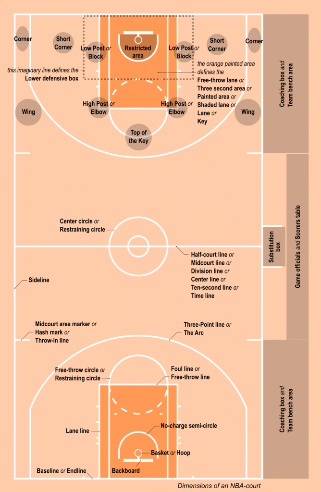
   <em>Court dimensions, lines, and areas (source: <a href="https://static.msfsports.com.au/wp-content/uploads/2019/05/Basketball_Court_Dimensions_Layout_terms-668x1024.png">MSF Sports</a>)</em>

### 2.2 Key Lines & Areas
- **Three-point line (arc):** Shots made from beyond this line are worth 3 points
  - NBA: 23 feet 9 inches (22 feet in corners)
  - NCAA: 22 feet 1.75 inches (moved back from 20'9" in 2019)
- **Free-throw line:** 15 feet from the backboard; where free throws are taken
- **The paint / the key / the lane:** The rectangular area near the basket
  - NBA: 16 feet wide
  - NCAA: 12 feet wide
- **Restricted area (arc):** A semi-circle under the basket (4 feet from the center of the basket in the NBA) defensive players inside this arc cannot take a charge
- **Mid-range area:** The space between the paint and the three-point line
- **The elbow:** Where the free-throw line meets the lane line
- **The block:** Marks on the lane where players line up during free throws
- **The wing:** Areas on either side of the court near the three-point line
- **The corner:** Where the sideline meets the baseline near the three-point line. The shortest three-point shot
- **Top of the key:** The area above the free-throw line at the top of the arc
- **The baseline / endline:** The boundary line behind each basket
- **The sideline:** The boundary lines on either side of the court
- **Half-court / center court:** The midline with the center circle for tip-offs
- **The hash marks:** Short lines on the sideline used for alignment (especially for inbound plays and time tracking)

### 2.3 The Backboard & Rim
- Backboard is a flat surface (usually glass in professional play)
- The rim has an 18-inch diameter
- **Bank shot:** Using the backboard to angle the ball into the basket

  
   <em>Tim Duncan's signature bank shot off the glass</em>

---

## 3. Scoring

### 3.1 Point Values
- **1 point:** Free throw (awarded after certain fouls)
- **2 points:** Field goal made from inside the three-point line
- **3 points:** Field goal made from beyond the three-point line
- A player's foot must be completely behind the three-point line for it to count as a three. If any part of the foot is on the line, it counts as a two

### 3.2 Types of Shots
- **Jump shot:** Player jumps and releases the ball at the peak of the jump

  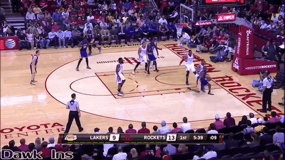
   <em>Kobe Bryant mid-range jump shot</em>

- **Set shot:** Feet stay on the ground (rarely used in modern basketball)
- **Layup:** A close-range shot where the player drives to the basket and lays the ball off the backboard or directly into the hoop

  
   <em>Kyrie Irving driving layup</em>

  - **Finger roll:** A layup where the ball rolls off the fingertips with soft touch

  
   <em>Finger roll finish at the rim</em>

  - **Reverse layup:** Going under or past the basket and shooting from the other side

  
   <em>Reverse layup under the basket</em>

  - **Euro step:** A two-step move where the player takes one step in one direction and then a second step in another direction to evade a defender. Initially popularized by Manu Ginobili, now pretty standard in the nba

  
   <em>Manu Ginobili's signature Euro step</em>

  - **Scoop layup:** Extending the arm low and scooping the ball up and in, often to avoid shot blockers

  
   <em>Scoop layup finish around defenders</em>

  - **Teardrop / floater:** A high-arcing shot from just inside the free-throw line to shoot over taller defenders

  
   <em>Tony Parker's signature teardrop floater</em>

- **Dunk:** Slamming the ball directly through the hoop from above

  
   <em>Vince Carter powerful slam dunk</em>

  - **Alley-oop:** A pass thrown near the basket that a teammate catches in mid-air and dunks or lays in

  
   <em>Alley-oop dunk</em>

  - **Putback dunk:** Grabbing an offensive rebound and dunking it immediately

  
   <em>Putback dunk off an offensive rebound</em>

  - **Posterizer:** A dunk over a defender (named because it could end up on a poster)

  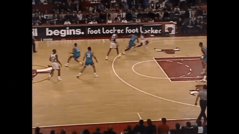
   <em>Poster dunk over a defender</em>

- **Hook shot:** A one-handed shot with the shooting arm extended to the side, arcing the ball over a defender.

  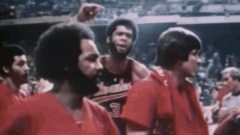
   <em>Kareem Abdul-Jabbar's legendary sky hook</em>

- **Fadeaway:** A jump shot where the shooter leans backward while shooting, creating space from the defender

  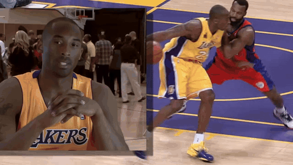
   <em>Kobe Bryant's signature fadeaway</em>

- **Step-back:** The shooter takes a quick step backward to create separation before shooting

  
   <em>James Harden step-back three pointer</em>

- **Pull-up jumper:** Dribbling toward the basket, then stopping suddenly to shoot a jump shot

  
   <em>Kobe Bryant pull-up mid-range jumper</em>

- **Catch and shoot:** Receiving a pass and immediately shooting without dribbiling

  
   <em>Klay Thompson catch-and-shoot three</em>

- **Tip-in / putback:** Tipping or tapping a missed shot into the basket off the offensive rebound

  
   <em>Nikola Jokic tip-in off the offensive glass</em>

- **Runner / push shot:** A one-handed running shot, typically in the lane

  
   <em>Tony Parker running floater in the lane</em>

- **Heave:** A desperation long-range shot, usually at the end of a quarter or game

  
   <em>Kyle Lowry half-court buzzer beater heave</em>

- **Mid-range jumper:** Any shot taken from inside the three-point line but outside the paint
- **Bank shot:** Intentionally using the backboard to score

### 3.3 And-One
- When a player is fouled while making a shot, the basket counts and the player gets one additional free throw
- If they make the free throw, it's called "completing the and-one" or a "three-point play" (off a two-point shot) or a "four-point play" (off a three-point shot)

  
   <em>And-one: basket counts plus a free throw</em>

### 3.4 Goaltending & Basket Interference
- **Goaltending:** A defensive player cannot block a shot while it is on its downward arc toward the basket, if they do, the basket counts automatically

  
   <em>Goaltending: blocking a shot on its downward arc</em>

- **Basket interference:** Neither team can touch the ball while it is on or directly above the rim, or touch the rim/net while the ball is in the cylinder above the rim

  
   <em>Basket interference violation</em>

- NBA and NCAA have slightly different interpretations of these rules

---

## 4. Game Structure & Time Rules

### 4.1 Game Length
- **NBA:** Four 12-minute quarters (48 minutes total)
- **NCAA Men's:** Two 20-minute halves (40 minutes total)
- **NCAA Women's:** Four 10-minute quarters (40 minutes total)
- **FIBA / International:** Four 10-minute quarters (40 minutes total)
- Overtime periods are 5 minutes in all leagues

### 4.2 The Game Clock
- Counts down from the period length to zero
- **When the clock runs (game clock is "running"):**
  - During normal live play
  - After made field goals (in NBA, clock starts when the inbounding team touches the ball)
- **When the clock stops:**
  - After any whistle (foul, violation, timeout, out-of-bounds)
  - After a made basket in the final minutes of a quarter (NBA: last minute of quarters 1-3, last two minutes of Q4/OT; NCAA: the clock stops after every made basket
  - When the ball goes out of bounds
  - During free throws
  - On any dead ball

### 4.3 Shot Clock
- **Purpose:** Prevents teams from holding the ball indefinitely; forces action
- **NBA:** 24 seconds to attempt a shot
- **NCAA Men's:** 30 seconds (was 35 seconds until 2015-16)
- **NCAA Women's:** 30 seconds
- The shot clock resets to:
  - 24 seconds (NBA) or 30 seconds (NCAA) after a change of possession
  - 14 seconds (NBA) after an offensive rebound (changed from 24 in 2018-19)
  - 20 seconds (NCAA) after an offensive rebound (changed from 30 in 2019-20)
- A shot must hit the rim for the shot clock to reset. An airball that doesn't touch the rim is a shot clock violation if time expires
- **Shot clock violation:** Turnover; the other team gets the ball

### 4.4 Other Time Rules
- **3-second violation (offensive):** An offensive player cannot stand in the paint (the lane) for more than 3 consecutive seconds, if they do, it's a turnover
  - The count resets the moment the player steps both feet out of the paint, even briefly
  - NBA only: there is also a **defensive 3-second violation**. A defender cannot remain in the paint for 3+ seconds without actively guarding an offensive player within arm's reach. Penalty: a technical foul (one free throw)
  - NCAA does NOT have a defensive 3-second rule, which is why zone defense is much more common in college
  - **Strategies for working around the defensive 3-second rule:**
    - **"Tagging" an offensive player:** A defender can reset or avoid the 3-second count by briefly touching or "tagging" a nearby offensive player in or near the paint. By positioning themselves close enough to an offensive player to be considered "actively guarding" them, even momentarily, the count resets. Defenders use this to camp near the paint as a help defender while technically complying with the rule. In practice, they will tag a nearby big man on the block, reset the count, and then resume their help position.
    - **"two nine" (stepping out and back in):** A defender will keep one foot in the paint and one foot out, or will stand in the paint and quickly step one foot outside the lane line for a brief moment just before the 3-second count expires, effectively resetting the clock. The concept is nicknamed "two nine" because the defender is estimating the count internally and stepping out at roughly 2.9 seconds before stepping right back in. This allows big men and help defenders to remain in or near the paint almost continuously while technically never violating the rule. It's a cat-and-mouse game with the referees. Officials are supposed to count 3 full seconds, but in practice, defenders who are good at the 2.9 technique can camp in the paint far more than the rule intends.
    - **Why these strategies matter:** The defensive 3-second rule was introduced (in 2001-02) specifically to prevent teams from parking a big man in the paint as a permanent shot deterrent, which killed driving lanes and made the game less entertaining. These workaround strategies are the defense's counter, maintaining paint presence while staying within the letter of the law. Analytics tools that track time in the paint and defensive positioning can identify players and teams that are most effective at exploiting these techniques.
- **5-second violation (inbound):** The player throwing the ball inbounds has 5 seconds to pass it in
- **5-second violation (closely guarded):** In NCAA, if an offensive player holds or dribbles the ball while closely guarded (within 6 feet) for 5 seconds, it's a turnover. This rule does NOT exist in the NBA.
  - **What counts as "closely guarded":** A defender must be within 6 feet of the ball handler and actively guarding them. The 5-second count begins when the defender is in this proximity and continues as long as they maintain it.
  - **What the ball handler can do:** The count applies whether the player is dribbling, holding the ball, or a combination. However, the count resets if the ball handler passes the ball, shoots, or if the defender backs off beyond 6 feet.
  - **Strategic impact in college basketball:** This rule significantly limits ball-dominant guards from holding the ball and surveying the defense. In the NBA, a player like Luka Doncic can hold the ball for 10+ seconds waiting for a play to develop. In college, a defender can force a 5-second call by pressuring aggressively. This makes college offenses more reliant on passing and player movement rather than iso-heavy ball handling.
  - **Defensive tactic:** Aggressive defenders in college use the closely guarded rule as a weapon by pressuring the ball handler and trapping them in situations where they can't easily pass or dribble out, forcing a turnover on the 5-second count. This is particularly effective against guards in the frontcourt who have already used their dribble or are near the sideline/corner with limited escape routes.
- **8-second violation (backcourt):** The offensive team has 8 seconds to advance the ball past half court (NBA); 10 seconds in NCAA
- **Timeout durations:**
  - NBA: Teams get 7 timeouts per game (each 75 seconds); mandatory timeouts are taken during certain TV breaks
  - NCAA: Teams get various timeouts (varies by media timeout structure); media timeouts occur at the first dead ball under the 16, 12, 8, and 4 minute marks of each half

### 4.5 End-of-Game Situations
- **Intentional fouling:** Trailing teams often foul intentionally to stop the clock and send the opponent to the free-throw line, hoping for misses
- **Clock management:** Leading teams try to use as much shot clock as possible to drain game time
- **Buzzer beater:** A shot released before the buzzer sounds but scoring after is legal as long as the ball left the player's hand before the clock expired
- **Review / instant replay:** Officials can review plays (shot clock, buzzer-beaters, flagrant fouls, out-of-bounds) using video in certain situations
  - NBA: Can review in the last 2 minutes of Q4 and all of OT
  - Coach's Challenge: NBA teams can challenge certain calls (see Section 14.3 for full details)

---

## 5. Positions & Player Roles

### 5.1 The Traditional Five Positions
1. **Point Guard (PG), "The 1"**
   - Primary ball handler and nicknamed floor general
   - Initiates the offense, calls plays, distributes the ball
   - Typically the smallest and quickest player on the court
   - Valued for passing, court vision, ball handling, leadership
   - Examples: Chris Paul, Magic Johnson, Steve Nash

  

<em>Chris Paul (6'0") — Team USA — compact, quick point guard build</em>

2. **Shooting Guard (SG), "The 2"**
   - Primary perimeter (3 pt) scorer
   - Strong outside shooter and off-ball movement (moving without the ball in their possession)
   - Typically taller than the PG with strong shooting ability
   - Examples: Michael Jordan, Kobe Bryant, Klay Thompson

  

<em>Kobe Bryant (6'6") — Team USA — lean, athletic shooting guard frame</em>

3. **Small Forward (SF), "The 3"**
   - The most versatile position, expected to do a bit of everything
   - Scores inside and outside, defends multiple positions, rebounds
   - Often the best all-around athlete on the team
   - Examples: LeBron James, Larry Bird, Kevin Durant

  

<em>LeBron James (6'9") — Team USA — versatile, muscular small forward build</em>

4. **Power Forward (PF), "The 4"**
   - Traditionally a physical, interior player (near the basket)
   - Rebounds, defends in the post, scores near the basket
   - In modern basketball, many PFs can shoot three-pointers ("stretch four")
   - Examples: Tim Duncan, Kevin Garnet, Giannis Antetokounmpo

  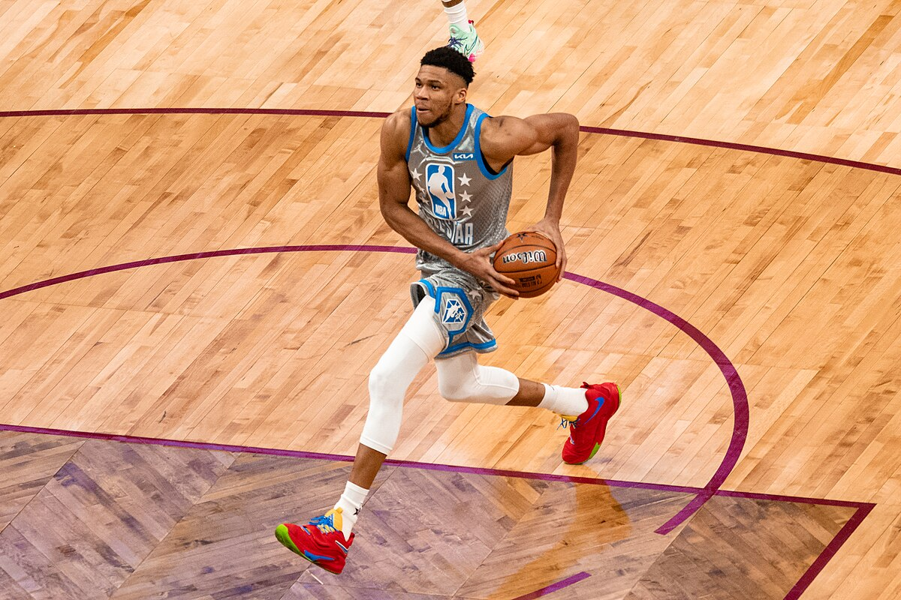

<em>Giannis Antetokounmpo (6'11") — NBA All-Star Game — long, powerful power forward frame</em>

5. **Center (C), "The 5"**
   - Typically the tallest player on the court
   - Anchors the defense (rim protection, shot blocking)
   - Rebounds, scores close to the basket (post-ups, dunks, putbacks)
   - Modern centers are increasingly expected to pass and even shoot threes
   - Examples: Shaquille O'Neal, Hakeem Olajuwon, Nikola Jokic

  

<em>Shaquille O'Neal (7'1") — Miami Heat — massive, dominant center build</em>

### 5.2 Position-Height-Agility Correlation
- Historically, there's a strong correlation: PGs are the shortest (~6'0"-6'3"), centers are the tallest (~6'10"-7'2")
- Speed and agility tend to decrease as height and size increase (with exceptions)
- Guards: quicker, better ball handlers, faster lateral movement
- Forwards/Centers: bigger, stronger, longer wingspan, better rebounders and shot blockers
- The correlation is not absolute, players like Magic Johnson (6'9" point guard) or Ben Simmons (6'10" point guard) break the mold

### 5.3 Positionless Basketball
- A modern trend where players are not defined by traditional positions
- Emphasizes versatility: every player should be able to shoot, pass, and defend multiple positions
- Teams often play five players who can all handle the ball and shoot threes
- **"Small ball":** Playing a lineup without a traditional center: using a shorter, quicker player at center to gain speed and spacing advantages (e.g., the Golden State Warriors with Draymond Green at center)
- **"Big ball":** Playing multiple tall players simultaneously, overwhelming opponents on the boards and in the paint
- The trend is driven by analytics showing the value of three-point shooting and switching on defense

### 5.4 Player Archetypes (Beyond Positions)
- **Floor general:** A point guard who controls tempo and runs the offense (Chris Paul)

  

<em>Floor General — Chris Paul orchestrating the offense</em>

- **Scorer / bucket getter:** A player whose primary job is to create and make difficult shots (Kevin Durant)

  

<em>Scorer — Kevin Durant getting buckets</em>

- **3-and-D player:** A role player who shoots three-pointers and plays elite defense (Klay Thompson, Mikal Bridges)

  

<em>3-and-D — Klay Thompson shooting from deep</em>

- **Stretch big:** A power forward or center who can shoot three-pointers, pulling opposing big men away from the basket and creating space (Kristaps Porzingis)

  

<em>Stretch Big — Kristaps Porzingis shooting from outside</em>

- **Rim protector / shot blocker:** A center or big man whose primary defensive value is protecting the rim (Rudy Gobert)

  

<em>Rim Protector — Rudy Gobert protecting the paint</em>

- **Playmaker:** A player (any position) who creates scoring opportunities for teammates through passing (Nikola Jokic, LeBron James)

  

<em>Playmaker — Nikola Jokic with the creative pass</em>

- **Two-way player:** Equally impactful on offense and defense (Kawhi Leonard)

  

<em>Two-Way Player — Kawhi Leonard impacting both ends</em>

- **Sixth man:** The best player coming off the bench, first substitute, often a key scorer (Manu Ginobili, Jamal Crawford)
- **Enforcer / energy guy:** A player who brings physicality, hustle, and toughness. Often sets hard screens, dives for loose balls (Patrick Beverley, PJ Tucker)

  

<em>Enforcer — Dennis Rodman diving for the loose ball</em>

- **Point forward:** A forward (typically SF) who handles point guard duties. Initiates offense, calls plays (LeBron James, Luka Doncic)

  

<em>Point Forward — LeBron James with the court vision pass</em>

- **Combo guard:** A player who can play both PG and SG

---

## 6. NBA vs NCAA Differences

### 6.1 Rules Differences
| Rule | NBA | NCAA |
|------|-----|------|
| Game length | 4 × 12-minute quarters | 2 × 20-minute halves |
| Shot clock | 24 seconds | 30 seconds |
| Three-point line | 23'9" (22' corners) | 22'1.75" |
| Lane width | 16 feet | 12 feet |
| Defensive 3-seconds | Yes | No |
| Fouls to foul out | 6 | 5 |
| Backcourt violation | 8 seconds | 10 seconds |
| Shot clock reset (offensive rebound) | 14 seconds | 20 seconds |
| Closely guarded rule | No | Yes (5 seconds) |
| Coach's challenge | Yes (max 2 successful per game; costs a timeout) | No (but replay used for certain situations) |
| Timeouts | 7 per game | Varies (team + media) |
| Quarters vs. halves | Quarters (bonus resets each quarter) | Halves (bonus accumulates all half) |

### 6.2 Style of Play Differences
- **NCAA is more structured:** Coaches have more control; plays are more scripted; players are less skilled and rely more on systems
- **NBA is more talent-driven:** Players are the best in the world and can improvise; offenses are more concept-based
- **NCAA zone defense** is very common (no defensive 3-second rule); NBA zone is less common but still used situationally
- **NCAA pace** is generally slower (30-second shot clock, less athletic players, more half-court offense)
- **NBA athleticism** is vastly superior. The speed, size, and skill gap between NBA and college is enormous
- **One-and-done / age rules:** Many top NBA prospects play just one year in college before entering the NBA draft
- **Transfer portal:** NCAA players can now transfer more freely, increasing player movement and reducing program stability
- **NIL (Name, Image, Likeness):** College players can now earn money from endorsements, which has shifted the landscape of college recruiting

### 6.3 Why These Differences Matter for Analytics
- Analytics models must account for rule differences (different shot clock, different three-point line distance)
- College data is noisier (smaller sample sizes, wider talent range, more team variance)

---

## 7. League Structure, Season & Playoffs

### 7.1 NBA Regular Season
- **82 games** played from mid-October through mid-April
- **30 teams** divided into two conferences: Eastern Conference and Western Conference
- Each conference has three divisions of five teams (divisions have minimal impact on standings)
- Teams play a mix of intra-conference and inter-conference games, with more games against conference opponents
- **Schedule factors that matter for analytics:**
  - **Back-to-backs:** Games on consecutive nights are associated with fatigue, lower performance, and higher injury risk
  - **Road trips:** Extended stretches of away games. Travel, time zones, and sleep disruption affect performance
  - **Rest days:** Teams with more rest between games tend to perform better
  - **Altitude:** Playing in Denver (5,280 feet elevation) presents a real conditioning challenge for visiting teams
  - **Schedule strength:** Not all 82-game schedules are equal; some teams face tougher opponents more frequently

### 7.2 NBA Standings & Seeding
- Teams are ranked 1-15 within each conference by win-loss record
- **Tiebreakers:** Head-to-head record, division record, conference record, point differential, etc.
- The top 6 seeds in each conference automatically qualify for the playoffs
- Seeds 7-10 enter the **Play-In Tournament**

### 7.3 The Play-In Tournament
- Introduced in 2020-21 as a permanent fixture
- **How it works:**
  - 7th seed vs. 8th seed: winner gets the 7th seed in the playoffs
  - 9th seed vs. 10th seed: loser is eliminated
  - Loser of 7v8 plays the winner of 9v10: winner gets the 8th seed, loser is eliminated
- Creates drama and incentives for borderline playoff teams; reduces late-season tanking for lottery teams at the margins

### 7.4 NBA Playoffs
- **16 teams** qualify (8 per conference)
- **Best-of-7 series** at every round first team to win 4 games advances
- **Bracket:**
  - First Round: 1v8, 2v7, 3v6, 4v5 (within each conference)
  - Conference Semifinals: Winners play (1/8 vs. 4/5, 2/7 vs. 3/6)
  - Conference Finals: Semifinal winners play
  - NBA Finals: Eastern Conference champion vs. Western Conference champion
- **Home court advantage:** The higher seed hosts Games 1, 2, 5, and 7 (2-2-1-1-1 format)
- The playoffs run from mid-April through mid-June
- **Why playoffs matter differently for analytics:**
  - Smaller sample sizes (4-7 games vs. 82)
  - Increased intensity, effort, and preparation
  - Teams game-plan specifically for one opponent (scouting, adjustments)
  - Rotations shorten (8-9 players instead of 10-11)
  - Stars play more minutes
  - Role players who are liabilities get exposed
  - Certain players give noticeably more effort in the playoffs

  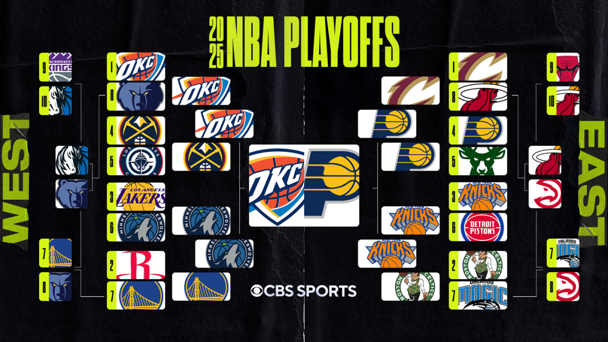

<em>Example: 2025 NBA Playoffs Bracket (CBS Sports)</em>

### 7.5 NCAA Tournament ("March Madness")
- **68 teams** qualify, 32 automatic bids (conference tournament champions) + 36 at-large bids (selected by committee)
- **Single elimination*:* lose and you're done (unlike NBA's best-of-7)
- **Seeding:** Teams are seeded 1-16 in four regions; matchups are 1v16, 2v15, 3v14, etc.
- Rounds: First Four → First Round → Second Round → Sweet Sixteen → Elite Eight → Final Four → National Championship
- **Selection Sunday:** The day the bracket is revealed. Teams are selected and seeded by a committee
- **Bracket busters / Cinderella teams:** Lower-seeded teams that upset higher seeds. The single-elimination format makes upsets far more common than in the NBA playoffs
- **Why this matters for analytics:** Single-elimination rewards variance; the "best" team doesn't always win. Predictive models for March Madness must account for the high randomness inherent in single games.

  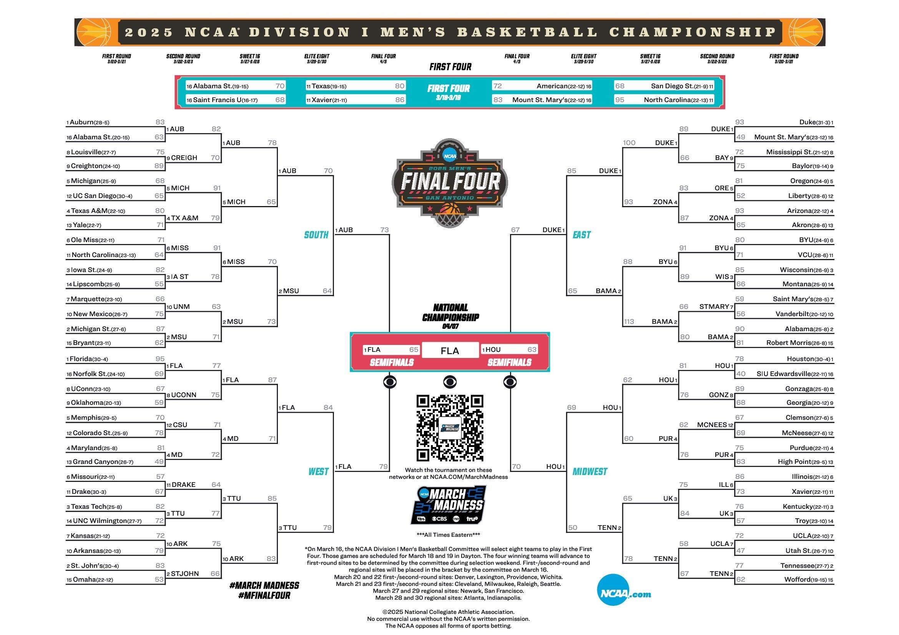

<em>Example: 2025 NCAA March Madness Bracket (NCAA.com)</em>

### 7.6 NCAA Regular Season & Conference Play
- Teams play ~30 games: a mix of non-conference games (early season) and conference games
- **Conference tournaments:** Each conference holds a tournament at the end of the regular season; the winner receives an automatic bid to the NCAA Tournament
- **NET rankings / RPI:** The NCAA uses computer-based ranking systems (NET replaced RPI in 2018-19) to help the selection committee evaluate teams
- **Strength of schedule:** Critical for evaluating NCAA teams because the talent gap between conferences is enormous (Big 12, SEC, Big Ten vs. smaller conferences)
- **Quad system:** The NCAA categorizes games into Quadrants 1-4 based on opponent ranking and location (home/away/neutral); Quad 1 wins are the most valuable for tournament selection

---

# Part 2: How the Game Is Played

---

## 8. Offensive Fundamentals

### 8.1 Ball Handling & Dribbling
- **Crossover:** Quickly switching the ball from one hand to the other in front of the body

  
   <em>Crossover dribble</em>

- **Between the legs:** Dribbling the ball between the legs for protection

  
   <em>Between the legs dribble</em>

- **Behind the back:** Dribbling behind the back to change direction

  
   <em>Behind the back dribble</em>

- **Hesitation (hesi):** A fake change of pace to freeze the defender

  
   <em>Hesitation move</em>

- **Spin move:** Spinning the body while dribbling to get past a defender

  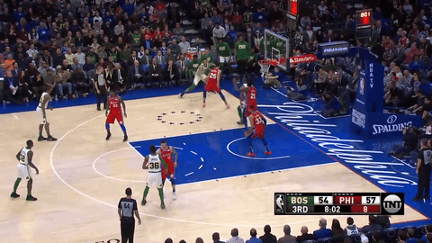
   <em>Spin move</em>

- **In-and-out:** Faking a crossover by pushing the ball to one side and pulling it back

  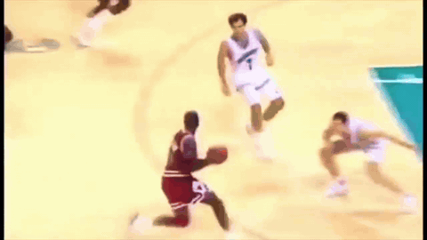
   <em>In-and-out dribble</em>

- **Change of pace:** Alternating speed (slow to fast or fast to slow) to throw off a defender

  
   <em>Change of pace</em>

### 8.2 Passing
- **Chest pass:** Two-handed pass from the chest

  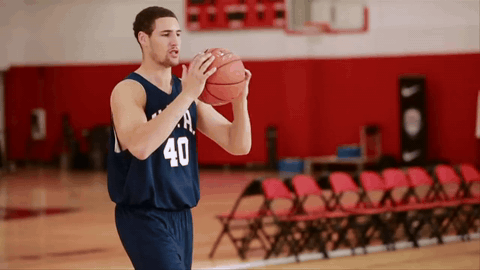
   <em>Chest pass</em>

- **Bounce pass:** The ball bounces once before reaching the receiver

  
   <em>Bounce pass</em>

- **Overhead pass:** Thrown from above the head

  
   <em>Overhead pass</em>

- **Skip pass:** A long cross-court pass that "skips" over defenders

  
   <em>Skip pass</em>

- **No-look pass:** Passing while looking in a different direction to deceive the defense

  
   <em>No-look pass</em>

- **Behind-the-back pass:** A flashy pass thrown behind the passer's back

  
   <em>Behind-the-back pass</em>

- **Lob pass:** A high-arcing pass, often for alley-oops

  
   <em>Lob pass</em>

- **Entry pass / post entry:** A pass into a player in the low post (near the basket)

  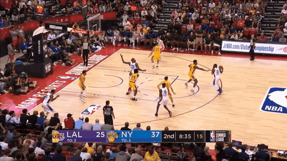
   <em>Entry pass / post entry</em>

- **Hockey assist:** The pass that leads to the assist pass (pass before the assist)

  
   <em>Hockey assist</em>

- **Kick-out pass:** When a player in the paint passes out to a shooter on the perimeter

  
   <em>Kick-out pass</em>

- **Dime:** Slang for a perfect assist/pass

### 8.3 Screening (Picks)
- **Screen / pick:** An offensive player stands still to block a defender's path, freeing a teammate
- The screener must be **stationary** (feet set) when contact occurs, a moving screen is an offensive foul
- **Ball screen / on-ball screen:** A screen set for the player who has the ball
  - **Pick and roll (PnR):** After setting the screen, the screener "rolls" (cuts) toward the basket looking for a pass

  
   <em>Pick and roll (PnR)</em>

  - **Pick and pop:** After setting the screen, the screener "pops" out to the perimeter for a jump shot instead of rolling to the basket

  
   <em>Pick and pop</em>

- **Off-ball screen:** A screen set for a player who does NOT have the ball
  - **Pin-down screen:** A screen set by a player closer to the basket for a teammate cutting toward the perimeter

  
   <em>Pin-down screen</em>

  - **Flare screen:** A screen set to free a player moving away from the ball (toward the corner or wing)

  
   <em>Flare screen</em>

  - **Back screen:** A screen set behind a defender, freeing the cutter to go toward the basket

  
   <em>Back screen</em>

  - **Cross screen:** A screen set across the lane for a player on the opposite block

  
   <em>Cross screen</em>

  - **Elevator screen / elevator doors:** Two players stand side by side, a teammate runs between them, then they close together like elevator doors to seal the defender out

  
   <em>Elevator screen / elevator doors</em>

- **Screen the screener:** An action where one player screens for a screener who is about to set another screen

  
   <em>Screen the screener</em>

- **Stagger screen:** Two screens set in sequence for the same player

  
   <em>Stagger screen</em>

- **Slip screen:** The screener fakes setting the screen and instead cuts to the basket early

  
   <em>Slip screen</em>

### 8.4 Off-Ball Movement
- **Cutting:** Moving without the ball toward the basket to receive a pass
  - **Backdoor cut:** Cutting behind the defender toward the basket when they are overplaying the passing lane

  
   <em>Backdoor cut</em>

  - **Curl cut:** Curling around a screen toward the basket

  
   <em>Curl cut</em>

  - **Flare cut:** Cutting away from the ball after using a screen, toward the three-point line

  
   <em>Flare cut</em>

  - **Give and go:** Passing to a teammate and immediately cutting to the basket for a return pass

  
   <em>Give and go</em>

- **Spacing:** Maintaining proper distance between offensive players (~12-15 feet apart) so that defenders can't help on multiple players at once
- **Reading the defense:** Reacting to what the defense does rather than following a rigid script

### 8.5 Off-Ball Movement Styles: Curry vs. Doncic
- **Stephen Curry (constant off-ball movement):**
  - Curry is elite both ON and OFF the ball
  - When he doesn't have the ball, he runs through a gauntlet of screens, changes direction multiple times, and forces defenders to chase him
  - His mere movement (even if he doesn't receive a pass) exhausts defenders and warps the entire defense
  - Curry's off-ball game: runs off pin-downs, curls, flare screens, back cuts, and creates chaos with constant motion
  - He is one of the best "catch-and-shoot" players ever

  
   <em>Stephen Curry's constant off-ball movement</em>

- **Luka Doncic (on-ball dominance):**
  - Doncic is primarily an on-ball player, he wants the ball in his hands
  - He creates through dribbling, pick-and-roll, step-backs, and passing
  - Off the ball, he is less active, he often stands and waits for the ball, conserving energy
  - His value comes from his ability to read defenses, make plays as a passer, and score in isolation

  
   <em>Luka Doncic's on-ball dominance</em>

- **Why it matters for analytics:** Understanding on-ball vs. off-ball impact is crucial. Traditional stats (assists, points) favor on-ball players. Off-ball impact (gravity, screen assists, hockey assists) is harder to measure but very valuable.

### 8.6 Post Play (Low Post Offense)
- **Post-up:** A player positions themself with their back to the basket near the block/paint

  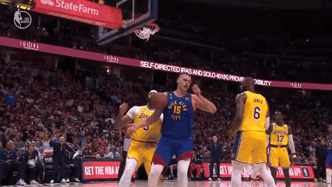
   <em>Post-up</em>

- **Drop step:** A quick move from the post position, stepping past the defender toward the basket

  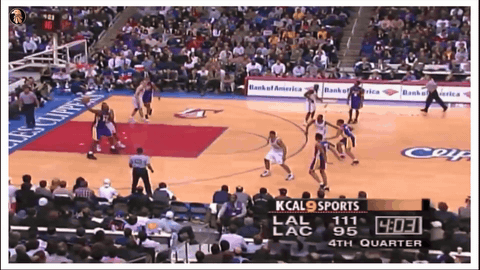
   <em>Drop step</em>

- **Up-and-under:** Faking a shot to get the defender in the air, then stepping under them for a layup

  
   <em>Up-and-under</em>

- **Dream shake:** A complex series of fakes and spins (popularized by Hakeem Olajuwon)

  
   <em>Dream shake</em>

- **Seal / pin:** Establishing position by placing the body between the defender and the basket

  
   <em>Seal / pin</em>

- Post play has declined in the modern NBA due to the emphasis on three-point shooting and pace, but it's still valuable situationally

### 8.7 Isolation (Iso) Play
- One offensive player goes one-on-one against their defender while teammates space the floor
- Relies on individual skill: dribbling, shooting, finishing
- Common for elite scorers: Kevin Durant, Kawhi Leonard, DeMar DeRozan
- Analytics generally show iso is less efficient than other play types, but elite iso scorers are invaluable in the playoffs when defenses tighten

  
   <em>Isolation (Iso) play</em>

---

## 9. Defensive Fundamentals

### 9.1 Types of Defensive Coverage

#### Man-to-Man Defense
- Each defender is assigned to guard a specific offensive player
- Requires individual defensive skill, effort, and communication
- Variations:
  - **Straight-up man:** Guarding your player tightly without help
  - **Switching man-to-man:** When two defenders switch assignments, often after a screen, "switching everything" has become extremely popular

  
   <em>Switching man-to-man defense</em>

  - **Hedge and recover:** After a screen, the screener's defender temporarily steps out to slow the ball handler, then recovers back to their original assignment
    - **Hedge:** The screener's defender steps out toward the ball handler to disrupt the pick-and-roll. The defender "hedges" (temporarily helps) to slow down the ball handler, giving the on-ball defender time to recover
    - **Hard hedge:** An aggressive hedge where the screener's defender steps out far and aggressively contests the ball handler, often forcing them to retreat or change direction. More disruptive but takes longer to recover
    - **Soft hedge:** A less aggressive hedge where the screener's defender takes a smaller step out, showing presence but not fully committing. Allows for quicker recovery but is less disruptive

  
   <em>Hedge and recover defense</em>

  - **Drop coverage:** The big man defending the screener drops back toward the basket instead of coming up to the ball handler. Protects the rim but gives up mid-range shots

  
   <em>Drop coverage defense</em>

  - **ICE / blue / push:** Forcing the ball handler away from the screen toward the sideline/baseline

  
   <em>ICE / blue / push defense</em>

  - **Blitz / trap:** Both defenders (on-ball and screener's defender) aggressively double-team the ball handler after a screen

  
   <em>Blitz / trap defense</em>

  - **Over the screen:** The ball handler's defender fights over the top of the screen (between the screener and the ball)

  
   <em>Over the screen defense</em>

#### Zone Defense
- Defenders guard areas of the court rather than specific players
- Types of zone:
  - **2-3 zone:** Two players up top, three along the baseline

  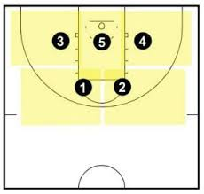
   <em>2-3 zone defense</em>

  - **3-2 zone:** Three players up top, two along the baseline

  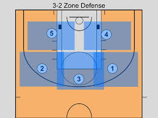
   <em>3-2 zone defense</em>

  - **1-3-1 zone:** One player up top, three across the free-throw line extended, one near the basket

  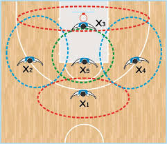
   <em>1-3-1 zone defense</em>

  - **2-1-2 zone:** Two up top, one in the middle, two on the blocks

  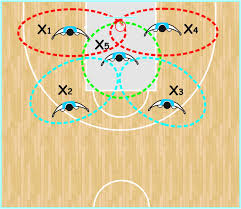
   <em>2-1-2 zone defense</em>

  - **Box-and-one:** Four players play zone, one player plays man-to-man on the opponent's best scorer
  - **Triangle-and-two:** Three players play zone (in a triangle), two play man-to-man on the two best scorers
  - **Matchup zone:** Looks like man-to-man but defenders pass off assignments based on zones
- Zone is much more common in NCAA (no defensive 3-second rule) than in the NBA
- Zone weakness: can be beaten by good three-point shooting and quick ball movement

#### Full-Court Defense
- **Full-court press:** Defending the entire court rather than just the half court
  - Applied to disrupt the opponent's ball advancement, create turnovers, and increase pace
  - Types: man-to-man press, 1-2-1-1 press, 2-2-1 press, diamond press

  
   <em>Full-court press defense</em>

- **Half-court trap:** Trapping the ball handler after they cross half court

  
   <em>Half-court trap defense</em>

- **Deny defense:** Aggressively preventing a specific player from receiving the ball

  
   <em>Deny defense</em>

### 9.2 On-Ball vs. Off-Ball Defense
- **On-ball defender:** The player guarding the ball handler
  - Goal: contain the ball handler, contest shots, force turnovers, prevent easy drives
  - Pressure: how aggressively the on-ball defender plays (full pressure vs. sagging back)
- **Off-ball defenders:** The four players NOT guarding the ball handler
  - **Help defense:** Moving toward the ball to help a teammate who has been beaten
  - **Gap defense:** Positioning between the player you're guarding and the ball to be in a help position
  - **Weak-side help:** Defenders on the side of the court away from the ball sag toward the paint to provide help
  - **Deny position:** Between the ball and the player you're guarding, preventing them from receiving a pass
  - **Closeout:** Sprinting from a help position to contest a shooter after the ball is passed. Proper closeout technique (running with short choppy steps, hand up) is critical to avoid giving up open shots or blow-bys
  - **Stunting:** Faking a help rotation to deter a pass or drive, then recovering to your man

### 9.3 Defensive Rotations
- When one defender helps (leaves their player), the entire defense must **rotate** to cover the now-open player
- Good rotations are fast, coordinated, and require constant communication
- **Rotation chain:** Player A helps → Player B rotates to cover A's man → Player C rotates to cover B's man → etc.
- **Scramble defense:** When rotations break down and the defense is frantically trying to recover
- **Shell drill:** A fundamental practice drill that teaches players help-side defense and rotations
- Bad defensive rotations are one of the most common reasons teams give up open three-pointers

### 9.4 Defensive Concepts
- **Rim protection:** A team's ability to contest and deter shots at the rim
- **Switching:** Trading defensive assignments, usually after a screen, big teams that can switch 1-5 (any position) are highly valued
- **Communication:** Constantly calling out screens ("screen left!"), assignments, and switches
- **Ball pressure:** How aggressively the defense contests the ball handler
- **Forcing baseline:** Steering the ball handler toward the sideline/baseline where help is easier
- **Shrink the floor:** The defense collapses into the paint, packing it with bodies to prevent inside scoring and dares the offense to shoot threes
- **No-middle defense:** Defensive philosophy of forcing ball handlers away from the middle of the court
- **Loaded / tag the roller:** When the screener rolls to the basket, a help defender "tags" them (bumps or bodys them) to slow them down
- **Nail position:** A help defender standing at the "nail", the center of the free-throw line, in position to help on drives from either side
- **Low man help:** The defender closest to the basket on the weak side provides first help on drives

---

## 10. Transition Basketball

### 10.1 Fast Break
- Pushing the ball up the court quickly after gaining possession (off a defensive rebound, steal, or made basket by the opponent) before the defense can set up
- **Outlet pass:** The first pass after a defensive rebound, typically from the rebounder to a guard
- **Rim running:** A big man sprinting down the court in transition ahead of the defense to catch a lob or layup pass
- **Primary break:** The first wave of the fast break, usually 1-3 players sprinting ahead
- **Secondary break:** The second wave of players who arrive slightly later but can run set actions
- **Transition offense** is among the most efficient play types because the defense isn't set
- **Transition defense:** Getting back quickly to prevent fast break points. "Getting back" is one of the most fundamental defensive principles

### 10.2 Pace
- **Pace:** The number of possessions a team uses per 48 minutes
- High-pace teams try to play fast and score in transition
- Low-pace teams try to slow the game down and play in the half court
- Pace is a critical analytical concept that affects every other stat, which is why "per 100 possessions" stats exist (to normalize for pace differences)

---

## 11. Rebounding

### 11.1 Types of Rebounds
- **Offensive rebound (OREB):** The offensive team recovers a missed shot, getting another possession
- **Defensive rebound (DREB):** The defensive team recovers a missed shot, ending the opponent's possession
- **Box out:** Establishing position between the opponent and the basket to gain rebounding advantage by using the body to seal the opponent away from the ball
- **Crash the boards:** Aggressively going after rebounds (especially offensive boards)
- **Tip rebound:** Tipping the ball to a teammate rather than catching it cleanly

### 11.2 Rebounding Strategy
- **Send vs. leak:** After a shot, does a team send players to the offensive glass (crash) or "leak" players out for fast break defense?
- **Long rebound:** A miss that bounces far from the basket, often going to guards on the perimeter
- Offensive rebounding rate is a key analytical stat. It gives extra possessions but can leave teams vulnerable on defense
- Teams must balance offensive rebounding aggression vs. transition defense

---

# Part 3: Fouls, Violations & Officiating

---

## 12. Fouls, Violations & Free Throws

### 12.1 Personal Fouls
- Any illegal physical contact such as pushing, holding, hitting, etc.
- **Each player is allowed 5 fouls** (NCAA) or **6 fouls** (NBA) before "fouling out" and being disqualified from the game
- **Team fouls:** Accumulate per quarter (NBA) or per half (NCAA). Once a team exceeds the limit, the opposing team enters the "bonus"

### 12.2 Types of Fouls

#### Shooting Fouls
- Contact on a player in the act of shooting
- Result: free throws
  - Fouled on a 2-point attempt: 2 free throws
  - Fouled on a 3-point attempt: 3 free throws
  - If the shot goes in despite the foul: basket counts + 1 free throw (and-one)
- **Landing space rule:** A defender cannot step under a shooter's landing space. This is an automatic shooting foul designed to protect players from ankle injuries (rule has been refined over recent years)
- **Natural shooting motion:** Referees judge whether the foul occurred during the "continuous shooting motion." The definition is subjective and controversial
- **Rip-through:** An offensive player swings the ball through a defender's arms to draw a foul. The NBA changed this to a non-shooting foul (side-out) in 2012

#### Blocking Foul
- A defender makes illegal contact by failing to establish position before the offensive player arrives
- The defender must be set (feet established, torso facing the ball handler) to draw a charge
- Often called on defenders who slide in too late to take a charge

#### Charge (Offensive Foul)
- The ball handler runs into a defender who has established legal guarding position (feet set, outside the restricted area)
- Results in a turnover for the offensive team
- **Restricted area:** Charges cannot be drawn while the defender is inside the restricted-area arc under the basket (in the NBA)
- **Block/charge** is one of the most subjective and debated calls in basketball

#### Other Offensive Fouls
- **Illegal screen / moving screen:** A screener is still moving when contact occurs
- **Push-off:** The ball handler or scorer uses their arm to push a defender away to create space. This is a common uncalled offensive foul
- **Chicken wing / arm bar:** Extending the elbow or forearm into a defender while driving. Called as an offensive foul if deemed excessive
- **Hooking:** Wrapping the arm around a defender to create an advantage
- **Clearing out:** Using the off arm to sweep a defender out of the way
- **Over-the-back:** Going over a player's back to grab a rebound (technically called a "push" foul)

#### Loose Ball Foul
- A foul committed when neither team has possession (e.g., during a rebound battle or scramble for a loose ball)

#### Flagrant Fouls
- Unnecessary or excessive contact
- **Flagrant 1:** Unnecessary contact. Penalty: 2 free throws + possession to the fouled team
- **Flagrant 2:** Unnecessary and excessive contact. Penalty: 2 free throws + possession + the offending player is ejected
- Flagrant fouls are **reviewable** and highly **subjective**. Referees consider the wind-up, intent, severity, and whether a basketball play was attempted
- Accumulating flagrant foul points across games can result in suspensions

#### Technical Fouls
- Non-contact fouls for unsportsmanlike behavior or rule violations
- Common reasons:
  - Arguing with referees
  - Taunting opponents
  - Hanging on the rim (except to protect safety)
  - Delay of game
  - Calling a timeout when you have none
  - Defensive 3-second violation (NBA)
  - Too many players on the court
- Penalty: 1 free throw + possession to the opposing team
- **Two technical fouls = automatic ejection**
- Accumulating 16 technical fouls in the NBA regular season results in a 1-game suspension (and 1 more for every 2 additional)

#### Away-from-the-play Foul / Off-Ball Foul
- A foul committed away from the ball, often intentional late in games to prevent fast breaks or free movement
- Penalty in the last 2 minutes of the game: 1 free throw + possession (designed to prevent "Hack-a-Shaq" type strategies away from the ball)

### 12.3 Foul Strategies
- **Hack-a-Shaq / intentional fouling:** Deliberately fouling a poor free-throw shooter to force them to the line. Named after Shaquille O'Neal (career 52.7% free throw shooter)
- **Take foul:** Intentionally fouling to stop a fast break. The NBA implemented a penalty for this in 2022-23: 1 free throw + possession for the fouled team
- **Strategic fouling:** Fouling when trailing late in the game to stop the clock and extend the game

### 12.4 Subjectivity in Officiating
- Many calls (block/charge, flagrant fouls, shooting fouls) involve significant referee judgment
- "Selling" contact: Players exaggerate or fake contact to draw fouls (flopping)
- **Flopping:** The NBA has an anti-flopping rule with fines for repeat offenders
- Referees have different tendencies. Some "let them play" while others call tight games
- Home court advantage is partly attributed to officiating tendencies in front of home crowds
- "Superstar calls" refers to the perception that star players get more favorable calls (debated but studied in analytics)

### 12.5 Free Throws
- Uncontested shots from the free-throw line (15 feet from the basket)
- Each free throw is worth 1 point
- The shooter has 10 seconds to release the ball
- Other players line up along the lane (block positions) and can move once the ball hits the rim
- **Good free-throw shooting** is 80%+; elite is 90%+; poor is below 70%

### 12.6 Bonus (Team Foul Penalties)
- **NBA:**
  - A team enters the **bonus** after the opposing team commits 5 team fouls in a quarter
  - In the bonus: any defensive foul (even non-shooting) results in 2 free throws
- **NCAA:**
  - **One-and-one:** After 7 team fouls in a half, the player shoots 1 free throw; if they make it, they get a second. If they miss the first, the ball is live.
  - **Double bonus:** After 10 team fouls in a half, the fouled player gets 2 free throws regardless
- Understanding bonus is crucial for late-game strategy and analytics

---

## 13. Turnovers & Ball Security

### 13.1 Violations (Non-Foul Turnovers)
- **Traveling:** Taking more than two steps without dribbling, or moving the pivot foot
  - The "gather step": the NBA allows a "gather" (picking up the dribble) plus two steps, which makes some moves look like traveling to casual observers but are legal
  - Euro step is legal because of how the gather step is counted
  - Traveling is one of the most debated and inconsistently called rules
- **Double dribble:** Stopping the dribble and then starting to dribble again, or dribbling with both hands simultaneously
- **Carrying / palming:** Putting the hand under the ball while dribbling (allowing the ball to "rest"). Rarely called in the modern NBA
- **Backcourt violation:** After the offense crosses half court, they cannot bring the ball back behind half court
- **Kicked ball:** A player cannot intentionally kick the ball. If the defense kicks it, the offense retains possession and the shot clock resets. If the offense kicks it, the defense gets the ball.
- **Out of bounds:** The ball or a player touching the ball touches the boundary line or beyond. The team that last touched the ball loses possession
- **Lane violation:** During free throws, entering the lane too early
- **Goaltending / basket interference:** (Covered in Section 3)

### 13.2 Deflections
- When a defender gets a hand on the ball (on a pass or dribble) without fully stealing it
- Deflections are a highly valued defensive stat because they correlate strongly with creating turnovers and disrupting the offense
- Not always tracked in traditional box scores but increasingly important in analytics

### 13.3 Steals
- When a defender takes the ball directly from the offense (off a pass or dribble)
- Steals often lead to fast break points (easy baskets in transition)

### 13.4 Turnover Types
- Bad pass / errant pass
- Lost ball (stripped by a defender)
- Offensive foul
- Violation (travel, shot clock, etc.)
- Stepping out of bounds
- Backcourt violation

---

## 14. Officiating & Referee Mechanics

### 14.1 Referee Crew
- **NBA:** 3 referees per game (lead, slot, trail)
- **NCAA:** 3 referees
- Referees rotate positions and have specific areas of responsibility
- Referees in the NBA are graded after every game and face accountability for missed calls

### 14.2 Referee Signals & Mechanics
- Hand signals for fouls, violations, made baskets, etc.
- The "block/charge" call requires the ref to determine whether the defender was set
- Referees use the restricted area arc to determine charge eligibility
- **Continuation:** Referees must determine whether a foul occurred during the shooting motion

### 14.3 Instant Replay & Review
- **Reviewable plays:**
  - Buzzer-beater shots (was it released in time?)
  - Out-of-bounds calls in the last 2 minutes
  - Flagrant foul evaluation
  - Goaltending/basket interference
  - Shot clock violations
  - Whether a foot was on the three-point line (2 vs. 3 points)
- **Replay Center (Secaucus, NJ):** The NBA has a centralized review center that can assist on-court officials
- **Coach's Challenge (NBA):**
  - **How it works:** A head coach triggers a challenge by calling a timeout. The timeout is "used" to initiate the challenge, so you cannot challenge without spending a timeout. The play is then reviewed by the officials using video replay.
  - **If the challenge is successful (call overturned):** The coach gets the timeout back. This means the team is not penalized for being right.
  - **If the challenge is unsuccessful (call stands):** The timeout is lost. The team is charged the timeout they used to trigger the challenge.
  - **Maximum of 2 successful challenges per game:** Even if a coach keeps winning challenges, they are capped at 2 successful challenges total per game. After winning 2 challenges, they cannot challenge again. (There is no limit on unsuccessful challenges other than running out of timeouts.)
  - **What CAN be challenged:**
    - Personal foul calls (was it actually a foul? was it a block or charge? was it on the right player?)
    - Out-of-bounds calls (which team touched it last?)
    - Goaltending / basket interference calls
    - Whether a shot was a 2-pointer or 3-pointer (foot on the line)
  - **What CANNOT be challenged:**
    - **Non-calls / missed calls:** This is the most important limitation. A coach can only challenge a call that was actually made. They cannot challenge a situation where they believe a foul should have been called but wasn't. For example, if a coach believes their player was fouled on a drive but no whistle blew, they cannot challenge. They can only challenge if a whistle blew and they disagree with the specific call that was made.
    - Judgment calls on violations like traveling or double dribble (these are not reviewable)
    - Technical fouls
    - Delay-of-game violations
    - Calls that occurred in prior possessions (must challenge before the next play begins)
  - **Timing:** The coach must signal the challenge quickly, before the ball is inbounded or put back into play for the next possession. Once the next play starts, the window to challenge has closed.
  - **Strategic considerations:** Coaches must weigh whether to use a challenge early in the game (when the call might not matter much) vs. saving it for a critical late-game moment. Burning a timeout on a failed challenge in the first half could cost the team a crucial timeout in the final minutes. Analytics can help identify which challenges are most likely to be overturned based on the type of call and historical overturn rates.

### 14.4 Referee Tendencies & Bias
- **L2M (Last Two Minute) Reports:** The NBA publishes official reports grading all calls (correct, incorrect, missed) in the final 2 minutes of close games
- Referees have measurable tendencies. Some call more fouls, some favor the home team, some are more whistle-happy
- **Makeup calls:** The perception (supported by some data) that referees compensate for a bad call by making the next call favor the other team
- Referee assignment for playoff games is based on regular-season performance ratings

---

# Part 4: Strategy & Coaching

---

## 15. Substitutions & Rotations

### 15.1 Substitutions
- Teams can substitute players during any dead ball (after a whistle)
- There is no limit on the number of substitutions
- **Checking in:** The substitute reports to the scorer's table and enters the game when the referee signals
- Players typically play in defined **rotation patterns** managed by the coach

### 15.2 Rotation Concepts
- **Starter:** One of the five players who begins the game
- **Bench / reserves:** Players who do not start but enter the game as substitutes
- **Rotation player:** A player who regularly gets minutes (typically an 8-10 player rotation in the NBA)
- **Sixth man:** The first player off the bench, often a key scorer or energy player
- **DNP (Did Not Play):** A player who does not enter the game at all
- **Garbage time:** The end of a blowout game where backups and end-of-bench players get minutes
- **Minutes distribution:** Managing how many minutes each player gets. Analytics teams study optimal minutes to balance performance and rest
- **Staggering:** Ensuring at least one star player is on the court at all times by offsetting their rest periods
- **Plus/minus lineup data:** Analyzing which combinations of players perform best together. Critical for rotation decisions

### 15.3 Foul Trouble
- When a key player accumulates fouls early, coaches may sit them ("bench them for foul trouble") to prevent them from fouling out
- Managing foul trouble is a strategic decision: risk leaving the player in (they might foul out) vs. sitting them and losing their production

---

## 16. Coaching & Play Calling

### 16.1 Types of Play Calls

#### Basic Actions
- **Pick and roll (PnR):** The most common action in basketball (covered in Section 8.3)
- **Give and go:** Pass and cut to the basket
- **Dribble handoff (DHO):** The ball handler dribbles toward a teammate and hands them the ball, similar to a running back taking a handoff. The receiver can shoot, drive, or pass
- **Isolation (Iso):** Clearing out for a one-on-one matchup
- **Post-up:** Getting the ball to a big man in the low post
- **Drive and kick:** Driving to the basket to collapse the defense, then passing ("kicking") to an open shooter on the perimeter

#### Set Plays
- Pre-designed sequences of actions to create specific scoring opportunities
- Named plays called out by the coach or point guard (e.g., "Horns," "Floppy," "1-4 Flat")
- **Horns set:** Two big men set up at the elbows (free-throw line extended). A versatile starting point for many actions
- **Floppy:** A play designed to get a shooter open off screens on either side of the basket
- **Motion offense:** A system of reads and rules rather than rigid plays where players react to the defense (example: the San Antonio Spurs under Gregg Popovich)
- **Triangle offense:** A complex offensive system using triangular player positioning and reads. Made famous by Phil Jackson's Chicago Bulls and LA Lakers
- **Princeton offense:** A read-based system emphasizing back-door cuts, ball movement, and unselfish play
- **Flex offense:** A continuity offense using down-screens and baseline cuts
- **UCLA cut:** A cut from the top of the key off a screen from the high post. The ball handler passes and cuts to the basket
- **Delay / spread offense:** Used to run clock; four players spread the court while the ball handler operates
- **ATO (After Time Out):** Set plays specifically designed for after-timeout situations. These are critical, and good coaches have a deep playbook of ATO plays
- **BLOB (Baseline Out of Bounds) / SLOB (Sideline Out of Bounds):** Specific plays for inbounding the ball from the baseline or sideline
- **End-of-game plays:** Special plays designed for last-shot situations

### 16.2 Offensive Systems & Philosophies
- **Pace and space:** Playing fast, shooting threes, spacing the floor. This is the modern NBA meta
- **Grind-it-out / slow pace:** Controlling tempo, getting high-quality looks, limiting possessions. Typical of defensive-minded teams
- **Seven seconds or less:** The Steve Nash-era Phoenix Suns system focused on getting a shot within 7 seconds of gaining possession
- **Motion offense / ball movement:** Emphasizing passing, cutting, and player movement. Often called "the beautiful game" (San Antonio Spurs)
- **Star-driven / iso-heavy:** Building the offense around a star player's ability to create (e.g., Houston Rockets with James Harden)
- **Inside-out:** Establishing the post game first, then kicking to shooters when the defense collapses

### 16.3 NBA vs. NCAA Play Calling
- **NCAA (College):** More structured plays; coaches call specific plays more often because players are younger, less experienced, and there's more roster turnover (4-year eligibility, transfers)
- **NBA:** More read-and-react; players are more talented and can improvise. Coaches set up initial actions but players make reads. The NBA game is more about concepts and principles than memorized plays.
- Coaching in the NCAA is often more controlling; NBA coaching is more collaborative. Elite NBA coaches create systems that empower player decision-making.

### 16.4 Adjustments
- **In-game adjustments:** Changing strategy, defensive schemes, or lineups based on what's happening
- **Halftime adjustments:** A significant opportunity to review film and change the game plan
- **Series adjustments (playoffs):** Studying film between games in a 7-game series and making strategic changes. This is where elite coaching matters most
- **Scouting reports:** Detailed analysis of opposing players and teams, covering tendencies, weaknesses, and habits
- **Matchup hunting:** Deliberately creating situations where your best offensive player is guarded by the opponent's weakest defender (often through screening actions)

---

## 17. Film & Video Analysis

### 17.1 The Role of Film Study
- Film study is one of the most important daily activities for coaches, players, and analytics staff
- Teams watch film before games (scouting opponents), after games (reviewing performance), and during practices (teaching concepts)
- Understanding film workflow is critical for anyone building or selling analytics tools because this is where your product plugs directly into a team's daily operations

### 17.2 Pre-Game Film (Scouting)
- **Opponent tendencies:** What plays does the opponent run most? What are their go-to actions out of timeouts? What are their preferred shot types?
- **Individual tendencies:** Does a player always go right? Do they favor a step-back three or a drive? How do they react to a blitz on the pick-and-roll?
- **Defensive schemes:** What coverages does the opponent use? Do they switch? Drop? Blitz? How do they defend the corner three?
- **Scouting reports:** Coaches compile written and video-based reports on every opponent, often 20-50+ pages, broken down by offensive sets, defensive coverages, individual player tendencies, and special situations (ATO, BLOB/SLOB, end of game)
- Analytics tools that can automate or accelerate scouting (tagging possessions, identifying tendencies, surfacing patterns) are extremely valuable

### 17.3 Post-Game Film (Review)
- **Grading:** Coaches and staff grade every possession. Was the right play run? Was the defensive assignment correct? Was the rotation executed properly?
- **Identifying breakdowns:** Where did the defense break down? Who missed a rotation? Who didn't box out?
- **Positive reinforcement:** Highlighting good plays, effort, and decision-making
- **Individual meetings:** Players review film of their own performance with coaches, focusing on specific areas for improvement
- **Turnaround time:** In the NBA, teams often play every other day, so post-game film review and pre-game scouting must happen quickly

### 17.4 Film Tagging & Categorization
- Every possession is "tagged" with metadata: play type, action, personnel, outcome, defensive coverage, etc.
- **Synergy / Second Spectrum:** The primary platforms teams use to tag, search, and analyze video
- Film can be searched by any combination of tags: "Show me every pick-and-roll where Player X was the ball handler and the defense switched"
- **Clip creation:** Coaches create short video clips to show players in meetings, focused on specific concepts or corrections
- This tagging and categorization process is where analytics tools provide the most immediate, daily value to coaching staffs

### 17.5 Practice Film
- Teams film practices and use video to teach concepts, correct mistakes, and install new plays
- **Walk-throughs:** Slow-paced practice sessions where players walk through plays and defensive schemes, often accompanied by video review
- Player development staff use film to track individual improvement over time

### 17.6 Video Rooms & Technology
- Every NBA team has a dedicated video room and video coordinator(s) on staff
- Coaches use tablets, large screens, and custom software to review and present film
- Real-time video access during games is increasingly common, and coaches can pull up clips during timeouts
- **Automation opportunity:** Much of film tagging is still manual or semi-manual; AI and computer vision are increasingly used to automate tagging, identify patterns, and surface insights faster

---

# Part 5: Measuring & Understanding the Game

---

## 18. Statistics & Box Score Basics

### 18.1 Traditional / Counting Stats
- **Points (PTS):** Total points scored
- **Rebounds (REB):** Total rebounds (OREB + DREB)
- **Assists (AST):** Passes that directly lead to a made basket
- **Steals (STL):** Taking the ball from the opponent
- **Blocks (BLK):** Deflecting an opponent's shot attempt
- **Turnovers (TOV):** Losing possession to the opponent
- **Minutes played (MIN)**
- **Field Goals Made/Attempted (FGM/FGA)**
- **Three-Point Field Goals Made/Attempted (3PM/3PA)**
- **Free Throws Made/Attempted (FTM/FTA)**
- **Personal Fouls (PF)**
- **Plus/Minus (+/-):** The point differential while a player is on the court (team score minus opponent score during that player's time)

### 18.2 Shooting Percentages
- **Field Goal Percentage (FG%):** FGM / FGA. The most basic shooting efficiency measure
- **Three-Point Percentage (3P%):** 3PM / 3PA
- **Free Throw Percentage (FT%):** FTM / FTA
- **Effective Field Goal Percentage (eFG%):** Adjusts FG% to account for the extra value of three-pointers: (FGM + 0.5 × 3PM) / FGA
- **True Shooting Percentage (TS%):** The most comprehensive shooting efficiency metric, accounting for 2-pointers, 3-pointers, and free throws: PTS / (2 × (FGA + 0.44 × FTA))
  - The 0.44 is a coefficient that estimates the number of possessions used by free throw attempts (accounting for and-ones, technicals, and three-shot fouls)

### 18.3 Usage Rate
- **Usage Rate (USG%):** The percentage of a team's possessions that a player "uses" (ends with a shot attempt, free throw attempt, or turnover) while on the court
- Formula: 100 × ((FGA + 0.44 × FTA + TOV) × (Team MIN / 5)) / (MIN × (Team FGA + 0.44 × Team FTA + Team TOV))
- **League average** is ~20% (since there are 5 players on the court, each using roughly 1/5 of possessions)
- **High-usage players** (30%+): Stars who dominate the ball, such as Luka Doncic, Joel Embiid, and Giannis Antetokounmpo
- **Low-usage players** (15% or below): Role players who primarily catch and shoot, set screens, and play defense
- **Why it matters:** Usage rate is essential context for interpreting scoring stats. A player averaging 25 PPG on 35% usage is far less efficient than one averaging 25 PPG on 25% usage. High usage typically means lower efficiency because the player is taking harder shots.
- **Usage vs. involvement:** Usage only counts possessions that END with a player. A player like Nikola Jokic may have moderate usage but extremely high involvement because he touches the ball constantly, passes, and creates for others, but doesn't always "use" the possession himself.

### 18.4 Per-Game vs. Per-Possession Stats
- **Per-game stats:** Points per game (PPG), rebounds per game (RPG), etc. These are affected by pace
- **Per-36 minutes:** Extrapolates stats to a 36-minute playing time. Useful for comparing players who play different minutes
- **Per-100 possessions:** Normalizes stats for pace and is the gold standard for comparison
- Always be aware of the "rate vs. volume" distinction: a player can have a high rate (efficiency) with low volume, or vice versa

### 18.5 Team Stats
- **Offensive Rating (ORtg):** Points scored per 100 possessions
- **Defensive Rating (DRtg):** Points allowed per 100 possessions
- **Net Rating:** ORtg - DRtg. The most fundamental measure of team quality
- **Pace:** Possessions per 48 minutes
- **Rebound rate (OREB% / DREB%):** Percentage of available rebounds secured
- **Turnover rate:** Turnovers per 100 possessions
- **Assist rate:** Percentage of field goals that are assisted
- **Free throw rate:** Free throw attempts per field goal attempt

---

## 19. Advanced Analytics & Metrics

### 19.1 Player Impact Metrics
- **PER (Player Efficiency Rating):** John Hollinger's all-in-one metric that attempts to capture all positive contributions in a single number. Criticized for overvaluing volume and not accounting for defense well. League average is 15.
- **BPM (Box Plus/Minus):** Estimates a player's contribution in points above average per 100 possessions, using box score data
- **VORP (Value Over Replacement Player):** BPM translated into a cumulative value over a "replacement-level" player
- **Win Shares (WS):** Credits a player with a share of team wins based on their contribution
- **RPM (Real Plus-Minus):** ESPN's regularized adjusted plus-minus. Uses play-by-play data and machine learning to estimate individual impact
- **RAPTOR:** FiveThirtyEight's player rating that combines box score and on/off data
- **EPM (Estimated Plus-Minus):** A newer all-in-one metric by Dunks & Threes
- **LEBRON (Luck-adjusted player Estimate using a Box prior Regularized ON-off):** BBall Index's comprehensive metric
- **DARKO:** A predictive player evaluation model

### 19.2 Shooting & Scoring Analytics
- **Shot charts / shot maps:** Visual representations of where a player takes and makes shots on the court
- **Shot quality:** Expected value of a shot based on location, distance, defender proximity, shot clock, etc.
- **Expected points per shot:** Combining shot selection and efficiency
- **Rim frequency:** How often a player shoots at the rim
- **Mid-range frequency:** How often a player shoots from mid-range (generally considered the least efficient area)
- **Corner three rate:** Corner threes are the shortest three-pointers and thus the most efficient
- **Free throw rate:** How often a player gets to the free-throw line relative to their shot attempts. Free throws are the most efficient shots in basketball
- **Points per possession (PPP):** How many points a play type generates per possession used
- **Shot selection:** Choosing high-value shots (at the rim, three-pointers, free throws) over low-value ones (long mid-range twos). This is a core analytical concept
- **Hot zones / cold zones:** Areas of the court where a player is significantly above or below league average in shooting

### 19.3 Play Type Classification
- Every possession in the NBA is categorized into a **play type** by Synergy / Second Spectrum. This is foundational to how analytics tools break down offense and defense
- **Major play types:**
  - **Pick-and-roll ball handler:** The player with the ball using a screen
  - **Pick-and-roll roll man:** The screener who rolls to the basket or pops for a shot
  - **Spot-up:** Catching and shooting (or driving) off a teammate's creation. The most common play type by volume
  - **Transition:** Scoring in the fast break before the defense sets up
  - **Isolation:** One-on-one play
  - **Post-up:** Scoring with the back to the basket
  - **Handoff:** Receiving the ball via a dribble handoff
  - **Cut:** Scoring by cutting to the basket without the ball
  - **Off-screen:** Scoring after running off an off-ball screen
  - **Putback:** Scoring off an offensive rebound
  - **Miscellaneous:** Everything else (broken plays, end-of-shot-clock heaves, etc.)
- **Points per possession (PPP) by play type** is the key metric because it tells you how efficient each action is
- **Frequency × efficiency:** The best offenses don't just run efficient play types; they run them at high volume. The worst offenses get stuck in inefficient play types (contested mid-range isolations, low-post mismatches that aren't actually mismatches).
- **Defensive play type data** mirrors this. You can see how a team defends each play type (e.g., "This team allows 0.85 PPP on pick-and-roll but 1.15 PPP on spot-ups")
- **Why this matters for analytics tools:** Play type data is one of the most actionable outputs for coaching staffs. It directly answers "what should we run more of?" and "what do we need to defend better?"

### 19.4 Shot Contest Categories
- Modern tracking data categorizes every shot by how closely it was defended:
  - **Wide open:** Nearest defender is 6+ feet away
  - **Open:** Nearest defender is 4-6 feet away
  - **Tight:** Nearest defender is 2-4 feet away
  - **Heavily contested:** Nearest defender is within 2 feet
- **Why contest matters:**
  - Wide open three-pointers are made at ~40%; heavily contested threes at ~30% or lower
  - The difference between a good and bad defense is often just 1-2 feet of contest distance
  - "Getting a hand up" (contesting a shot) is more valuable than it appears. Even partial contests significantly reduce shooting percentages
- **Contest rate:** What percentage of opponent shots does a team or player contest? Teams that contest a higher percentage of shots tend to have better defenses.
- **Defensive shot quality:** Combining contest distance, shot location, and shooter skill to estimate how many points the defense "should" have allowed. Comparing this to actual points allowed reveals whether a defense is getting lucky or unlucky
- **Analytics application:** Shot contest data is one of the most direct ways to evaluate defensive effort and scheme. A player might not get many blocks or steals but could be elite at contesting shots, which is invisible in traditional box scores but visible in tracking data.

### 19.5 Playmaking Analytics
- **Assist-to-turnover ratio (AST/TOV):** Measures passing efficiency and ball security
- **Potential assists:** Passes that would have been assists if the teammate made the shot
- **Assist points created:** Total points generated by a player's assists
- **Secondary assists (hockey assists):** The pass that leads to the pass that leads to the basket
- **Screen assists:** Assists on baskets where the player set the screen that freed the scorer
- **Passer rating:** Advanced metric evaluating the quality and impact of a player's passes
- **Time of possession:** How long a player holds the ball. Shorter possession often correlates with better offense
- **Touches:** How many times a player touches the ball in a game

### 19.6 Defensive Analytics
- **Defensive Rating (individual):** Points allowed per 100 possessions when this player is on the court
- **Opponent FG% at the rim / Rim protection:** How effective a player is at contesting shots at the basket
- **Contested shots:** Number of shots where the defender is within a certain distance
- **Deflections:** How often a player gets a hand on the ball
- **Charges drawn:** Drawing offensive fouls
- **Matchup data:** How specific players perform against specific opponents
- **Defensive win shares**
- **Block percentage (BLK%):** Percentage of opponent 2-point attempts blocked while on the floor
- **Steal percentage (STL%):** Percentage of opponent possessions where the player records a steal
- **Opponent points in the paint:** How many points a team allows in the paint when this player is on the floor
- **DIFF (Defensive Impact on Field Goal%):** The difference in opponent's FG% when guarded by this player vs. league average
- Defense is historically the hardest thing to measure with statistics because much of it is invisible (positioning, communication, deterrence)

### 19.7 Lineup & On/Off Data
- **Lineup data:** How specific 5-player combinations perform (Net Rating, ORtg, DRtg)
- **On/Off splits:** Comparing team performance with a player on the court vs. off the court
- **Clutch stats:** Performance in "clutch" situations (close games in the final 5 minutes, etc.)
- **Two-man / three-man lineups:** How pairs or trios of players perform together
- **Minutes together:** How many minutes certain combinations have played. Small sample sizes make lineup data noisy

### 19.8 Tracking Data (Player & Ball Tracking)
- **Second Spectrum / Hawk-Eye / optical tracking:** Cameras in NBA arenas track every player and the ball 25 times per second
- Data captured includes:
  - Player speed and distance traveled
  - Player positions (x, y coordinates) at every moment
  - Ball position and trajectory
  - Closest defender distance on every shot
  - Drive frequency and success rate
  - Post-up frequency and success rate
  - Catch-and-shoot vs. pull-up shooting
  - Transition frequency
  - Rebounding chances and conversion
  - Screen effectiveness
  - Pass type and success rate
  - Defensive matchup time
- This data fuels modern advanced analytics and is the frontier of basketball analysis

### 19.9 Efficiency Concepts
- **Points per possession (PPP):** The gold-standard efficiency metric for plays and players
- **High-percentage shots:** Shots with high expected value, including layups/dunks (~60-70% FG%), corner threes (~39% × 1.5 = high value), free throws (~77% league avg)
- **Low-percentage shots:** Long mid-range twos (~40% × 2 = ~0.80 PPP), considered the "worst" shot in basketball by analytics
- **The "Moreyball" philosophy:** Named after Daryl Morey. The core idea: shoot threes and layups, avoid mid-range twos (unless you're at the free-throw line). This revolutionized the NBA.
- **Possessions are the currency:** Every possession is an opportunity. Turnovers, offensive rebounds, and pace all affect how many possessions a team gets. Efficiency (points per possession) is what wins games.

---

## 20. Abstract & High-Level Concepts

### 20.1 Gravity
- **Definition:** The degree to which a player warps the defense simply by being on the court, even without touching the ball
- A player with high gravity (like Stephen Curry) forces the defense to account for them at all times, which opens up opportunities for teammates
- Example: Curry standing at the three-point line forces his defender to stay close; if help comes to Curry's area, someone else is open
- **Why it's hard to measure:** Gravity is invisible in box scores. Curry might score 20 points but create another 15 points through gravity that never shows up in his stats.
- Gravity is one of the most important concepts for understanding off-ball impact

### 20.2 Spacing
- The concept of spreading players apart on the court to create driving lanes and open shots
- **Good spacing:** Players are positioned ~12-15 feet apart; defenders can't help without leaving a shooter open
- **Bad spacing:** Players are clumped together; defenders can cover multiple threats
- A team of five three-point shooters has the best spacing, which is why the modern NBA values shooting so highly
- **Floor spacing** is perhaps the single most important offensive concept in modern basketball

### 20.3 Pace & Tempo Control
- The strategic decision of how fast or slow to play
- Faster pace = more possessions = more variance = favors the less talented team (upsets)
- Slower pace = fewer possessions = less variance = favors the more talented team
- In playoff series, better teams often slow the pace; underdogs try to speed it up

### 20.4 Leverage & Matchup Hunting
- **Mismatch:** When a player is guarded by someone they have a clear advantage over (e.g., a quick guard on a slow center, or a big center on a small guard in the post)
- **Matchup hunting / switch hunting:** Deliberately running offensive actions to create mismatches, for example repeatedly screening to get a slow big man switched onto a fast guard
- This is a major area for analytics: identifying which matchups to target and which to avoid

### 20.5 Two-for-One
- At the end of a quarter, if there's enough time (approximately 30-40 seconds left on the game clock), a team will take a quick shot to ensure they get the ball back for a second possession before the quarter ends
- Instead of running a full play, they shoot early to "guarantee" two possessions while the opponent only gets one
- Coaches and analytics teams track two-for-one execution closely

### 20.6 Win Probability & Expected Value
- **Win probability:** A model that estimates the chance of winning at any given point in a game based on score, time remaining, possession, etc.
- **Expected value:** The average outcome of a decision. For example, should you foul when up 3 with 10 seconds left? Analytics models calculate the win probability of fouling vs. not fouling.
- These models inform in-game strategy and are a key product for analytics tools

### 20.8 Basketball IQ & Feel for the Game
- **Definition:** A player's ability to read situations, anticipate what's about to happen, and make the correct decision in real time
- High-IQ players (Chris Paul, LeBron James, Nikola Jokic) seem to always be in the right place, make the right pass, and exploit defensive mistakes before they fully develop
- **Components of basketball IQ:**
  - **Reading the defense:** Recognizing what coverage the defense is in and knowing the correct counter
  - **Anticipation:** Predicting where the ball or players will be before it happens. Elite passers throw to where the receiver WILL be, not where they are
  - **Decision speed:** How quickly a player processes information and acts. This is the difference between a good decision made slowly (too late) and a good decision made instantly (effective)
  - **Off-ball awareness:** Knowing when to cut, when to space, when to screen, when to relocate, all without being told
  - **Defensive awareness:** Knowing when to help, when to stay home, when to switch, when to rotate by reading the offense's intent
  - **Situational awareness:** Understanding the score, time, foul situation, shot clock, and adjusting behavior accordingly (e.g., not fouling when up 3, taking a two-for-one, managing the clock)
- **Why it's hard to quantify:** Basketball IQ doesn't appear in any box score. It's the "invisible" quality that separates good players from great ones.
- **The "eye test":** Evaluating players by watching them play rather than relying solely on statistics. Basketball IQ is the primary thing the eye test captures that stats miss.
- **Coaching and development:** Basketball IQ can be improved through film study, repetition, experience, and good coaching all develop a player's feel for the game. Young players often have physical tools but lack IQ; veteran players often compensate for declining athleticism with superior IQ.

### 20.9 Clutch Performance
- Performance in high-leverage, late-game situations
- Is "clutch" a real, repeatable skill, or is it just statistical noise? (One of the great debates in sports analytics)
- Analytics shows most players perform close to their career averages in clutch situations, but context and pressure can affect marginal players
- Playoff performance vs. regular season performance is hard to evaluate because sample sizes are small

### 20.10 Home Court Advantage
- Teams win more at home (~60% in the NBA historically, even more in college)
- Causes: crowd energy, referee influence, travel fatigue, familiarity with the court, sleep/routine disruption
- Analytics quantifies home court advantage and adjusts ratings accordingly

### 20.11 The Value of a Possession
- Each NBA possession is worth approximately 1.1 points (as of recent seasons)
- This means: a turnover "costs" ~1.1 points; an offensive rebound is "worth" ~1.1 points
- Understanding possession value is foundational for any basketball analytics product

### 20.12 Opportunity Cost
- Every decision has a trade-off: taking a mid-range jumper means NOT attempting a three or driving to the basket
- Minutes given to Player A are minutes NOT given to Player B
- Analytics helps quantify these trade-offs

### 20.13 Marginal Value
- The difference between what a player provides vs. what a replacement-level player would provide
- This is the basis of metrics like VORP and WAR-type calculations
- Critical for front office decision-making (trades, free agency, draft)

### 20.14 Draft Value & Player Development
- **Draft picks** have expected value based on historical performance of players drafted at each position
- Higher picks are more valuable (more likely to yield a star)
- **Player development:** How much can a player improve? Young players typically improve through their mid-20s, then plateau
- **Aging curves:** Statistical modeling of how players' skills change with age. Scoring peaks around 25-27, defense often improves into the late 20s, decline accelerates after 30-32

---

# Part 6: The Business & Context of Basketball

---

## 21. Salary Cap, Contracts & Roster Construction

### 21.1 The Salary Cap
- The NBA has a **soft salary cap**, meaning teams can exceed it using specific exceptions (unlike the NFL's hard cap)
- The cap is calculated as a percentage of **Basketball Related Income (BRI)**, which includes revenue from TV deals, tickets, merchandise, etc.
- **Cap number** changes every season (typically increases). For reference, it was approximately $136 million for the 2024-25 season
- The cap determines how much teams can spend on player salaries and directly affects every roster decision

### 21.2 Key Cap Concepts
- **Luxury tax:** A penalty paid by teams whose total payroll exceeds the luxury tax threshold (set above the salary cap). For every dollar over the threshold, teams pay a progressively increasing tax, ranging from $1.50 to $3.75+ per dollar over, depending on how far over they are.
- **Luxury tax apron:** A hard ceiling above the luxury tax line. Teams above the apron face severe restrictions on transactions (can't sign free agents with certain exceptions, can't aggregate salaries in trades, etc.). This is effectively a hard cap for competitive balance.
- **Cap space:** The difference between a team's current payroll and the salary cap. It determines whether they can sign free agents outright
- **Over the cap:** Most NBA teams operate over the salary cap; they use exceptions (see below) to add players
- **Cap holds:** Placeholder amounts that count against the cap for unsigned draft picks and free agents. Teams must renounce these holds to create cap space, but doing so means losing the right to re-sign those players using Bird Rights

### 21.3 Contract Types
- **Max contract:** The maximum salary a player can earn, based on years of experience. A player with 10+ years of experience can earn ~35% of the cap; 7-9 years ~30%; 0-6 years ~25%. Supermax contracts (for qualifying players) can reach ~35% regardless of experience.
- **Rookie-scale contract:** Drafted players sign contracts with pre-set salaries determined by their draft position. First-round picks get guaranteed 2-year deals with team options for years 3 and 4. Second-round picks have no guaranteed contract structure.
- **Veteran minimum contract:** The lowest salary a player can earn, based on years of experience. Teams can sign players to minimums even if over the cap.
- **Mid-level exception (MLE):** An exception that allows over-the-cap teams to sign a free agent for a mid-range salary (~$12-13 million). There are different versions (taxpayer MLE, non-taxpayer MLE, bi-annual exception).
- **Two-way contract:** A contract where the player splits time between the NBA team and its G League affiliate. Teams can have up to two two-way players. These contracts pay less and don't count fully against the cap.
- **10-day contract:** A short-term deal (10 days) used to evaluate players mid-season. Teams can sign players to multiple 10-day contracts.

### 21.4 Bird Rights & Player Retention
- **Bird Rights:** Named after Larry Bird. If a player has been on a team for 3+ consecutive years (including via trade), the team can re-sign them for more money and years than other teams can offer, AND can exceed the salary cap to do so.
- **Early Bird Rights:** After 2 years with a team; offers a smaller advantage
- **Non-Bird Rights:** After 1 year; the smallest advantage
- **Why this matters:** Bird Rights are the primary mechanism by which teams retain their own stars. Losing a player in free agency without getting anything back (because the team has no cap space to replace them) is one of the worst outcomes in basketball. Bird Rights prevent this by allowing teams to outbid competitors for their own players.

### 21.5 Trades & Salary Matching
- **Salary matching rules:** When teams trade players, the salaries must approximately match (within 125% + $100K of the outgoing salary for teams over the cap). Under-the-cap teams have more flexibility.
- **Trade exceptions:** When a team trades away a higher-salaried player and receives a lower-salaried player (or nothing), they receive a trade exception equal to the difference. This can be used to absorb salary in a future trade within one year.
- **Sign-and-trade:** A team signs their own free agent and immediately trades them to another team. This allows the receiving team to acquire a player they couldn't sign outright and allows the original team to get assets in return.
- **Draft pick compensation:** Draft picks (current and future) are the primary currency in NBA trades. Teams can trade picks up to 7 years out, subject to the **Stepien Rule** (cannot trade first-round picks in consecutive years, to prevent teams from mortgaging their entire future).
- **Trade deadline:** A date in February after which no more trades can occur until the offseason. The trade deadline creates a frenzy of activity as teams decide whether to "buy" (add players for a playoff push) or "sell" (trade veterans for draft picks and young players).

### 21.6 Free Agency
- **Unrestricted free agent (UFA):** A player who can sign with any team; their current team has no special rights beyond Bird Rights
- **Restricted free agent (RFA):** A player whose original team has the right to match any offer sheet from another team. This gives the original team the final say.
- **Free agency opens** on the first day after the moratorium period in late June/early July, the period when teams negotiate with free agents
- **Tampering:** Teams are not allowed to negotiate with other teams' players before free agency opens (though enforcement is spotty and circumvention is widely acknowledged)

### 21.7 Why Salary Cap Matters for Analytics
- **Every roster decision is a resource allocation problem:** Teams have a finite budget and must allocate it optimally across 15 roster spots
- **Cost-per-win analysis:** Which players provide the most value relative to their salary? Underpaid players (usually those on rookie-scale contracts or below-market deals) are the most valuable assets.
- **Draft picks as value:** Rookie-scale contracts are extremely valuable because top picks provide star-level production at a fraction of star-level cost for 4+ years
- **Cap projection models:** Analytics teams model future cap situations to plan multi-year strategies, asking questions like "If we sign Player X this year, can we afford to re-sign Player Y next year?"
- **Trade evaluation:** Every trade must be evaluated not just on talent but on salary implications, luxury tax consequences, and future flexibility

---

## 22. The NBA Draft & Lottery

### 22.1 Draft Structure
- **Two rounds, 60 picks total** (30 picks per round, one per team, though picks are frequently traded)
- Held annually in late June
- Players are eligible if they are at least 19 years old and one year removed from high school graduation (though these age rules may change)
- **Draft order:** Determined by a combination of lottery (for non-playoff teams) and reverse order of playoff finish (for playoff teams)

### 22.2 The Draft Lottery
- The **14 teams** that missed the playoffs enter the lottery
- **Lottery odds** are weighted by record. The worst team has the best chance of getting the #1 pick, but it's not guaranteed
- **Current odds (2019 reform):** The three worst teams each have a 14% chance at #1; odds decrease gradually from there
- The lottery determines the top 4 picks; picks 5-14 are assigned in reverse order of record
- **Purpose of the lottery:** To discourage tanking (losing on purpose to get a better draft pick). Before the lottery existed, the worst team automatically got the #1 pick, creating a perverse incentive.
- **Tanking is still a real phenomenon:** Even with the lottery, having a worse record increases your odds. Teams sometimes "tank" by trading away veterans, playing young players heavy minutes, and prioritizing development over winning.

### 22.3 Draft Pick Value
- **Historical analysis** shows that the expected value of a draft pick decreases sharply after the top few picks:
  - #1 picks produce All-Stars at a high rate (~50%+)
  - Top 5 picks produce quality starters at a reasonable rate
  - Picks 10-20 are a mix of starters and role players
  - Late first-round picks are mostly role players with occasional gems
  - Second-round picks rarely become significant contributors (but some notable exceptions: Nikola Jokic was pick #41, Draymond Green #35, Isaiah Thomas #60)
- **Draft pick trade value:** Because of this expected value curve, top picks are extraordinarily valuable in trades. A top-5 pick is often worth multiple mid-round picks or an established starter.

### 22.4 The Scouting & Evaluation Process
- **College scouting:** Watching NCAA games, studying film, analyzing stats
- **International scouting:** Evaluating players in European, Australian, and other professional leagues worldwide
- **NBA Draft Combine:** An annual event where draft prospects go through physical measurements, athletic testing, and competitive scrimmages in front of all 30 teams
- **Individual workouts:** Teams invite prospects for private workouts at their facilities
- **Interviews:** Teams conduct formal and informal interviews to evaluate personality, character, work ethic, basketball IQ, and fit
- **Medical evaluations:** Physical exams, injury history review, and health screenings. A player's medical report can significantly affect their draft stock

### 22.5 Draft Analytics & Projection Models
- **College-to-NBA translation:** Models that estimate how a college player's stats will translate to the NBA level. This is a key application for analytics tools
- **Physical profile modeling:** Combining measurables (height, wingspan, speed, vertical leap) with statistical production to project NBA outcomes
- **Comparable players (comps):** Finding historical players with similar profiles to estimate a prospect's range of outcomes
- **Bust probability:** Estimating the chance that a highly drafted player fails to become a productive NBA player
- **Archetype identification:** Categorizing prospects into player archetypes to understand their projected role
- **Draft models** are one of the highest-value applications for basketball analytics tools. Teams spend enormous resources trying to gain even a small edge in draft evaluation

### 22.6 Pick Protections & Swaps
- **Protected picks:** When a team trades a first-round pick, they can protect it, meaning it doesn't transfer if it falls within a certain range (e.g., "top-10 protected" means the pick only transfers if it's #11 or later)
- **Pick swaps:** The right to swap first-round picks with another team, which is valuable if the other team is worse. The team with the swap right takes the better pick.
- **Pick conveying:** A protected pick that doesn't convey (because it falls in the protected range) typically "rolls over" to the next year with lessened protections, eventually becoming unprotected
- These mechanisms create complex webs of future obligations that analytics tools help teams model and evaluate

---

## 23. Awards & Accolades

### 23.1 Regular Season Awards
- **Most Valuable Player (MVP):** The best overall player in the regular season, voted on by a panel of media members. The most prestigious individual award.
- **Defensive Player of the Year (DPOY):** The best individual defender
- **Rookie of the Year (ROY):** The best first-year player
- **Sixth Man of the Year (6MOY):** The best player who comes off the bench (doesn't start most games)
- **Most Improved Player (MIP):** The player who made the biggest improvement from the previous season
- **Coach of the Year (COY):** The best head coach

### 23.2 All-NBA & All-Defensive Teams
- **All-NBA:** Three teams (First, Second, Third) of 5 players each, representing the 15 best players in the league
  - **Critical for contracts:** All-NBA selection triggers eligibility for the **supermax extension** (Designated Veteran Player Extension), which can be worth tens of millions of dollars more than a regular max contract
  - This creates an analytically interesting dynamic: being named All-NBA has massive financial implications beyond just prestige
- **All-Defensive:** Two teams (First, Second) of 5 players each, representing the 10 best defenders in the league
- Voted on by a panel of media members

### 23.3 All-Star Game
- **All-Star Weekend:** An annual mid-season event featuring the best players
- **Starters:** Selected by a combination of fan voting (50%), player voting (25%), and media voting (25%)
- **Reserves:** Selected by head coaches in each conference
- **All-Star selection** is a career accolade that affects legacy, marketability, and sometimes contract bonuses
- **All-Star snubs:** Players who arguably deserved selection but were left out. This is a perennial source of debate and analytics discussion

### 23.4 Playoff Awards
- **NBA Finals MVP:** The best player in the championship series
- **Conference Finals MVP:** Added recently
- **Playoff MVP (proposed):** A broader playoff performance award

### 23.5 Statistical Titles
- **Scoring title:** Leading the league in points per game (65-game minimum)
- **Assists title:** Leading in assists per game
- **Rebounds title:** Leading in rebounds per game
- Other categories: steals, blocks, three-pointers made, free throw percentage, field goal percentage
- The 65-game minimum (introduced 2023-24) directly connects to load management debates

### 23.6 Historical & Career Accolades
- **Hall of Fame:** The Naismith Memorial Basketball Hall of Fame, recognizing career achievement
- **MVP shares:** A player's cumulative MVP voting over their career. Useful for historical comparisons
- **Career milestones:** All-time points, assists, rebounds lists, tracked meticulously (e.g., LeBron James passing Kareem Abdul-Jabbar as all-time leading scorer)
- **Championships (rings):** Winning the NBA Finals. The ultimate team achievement and a major factor in legacy debates

### 23.7 Why Awards Matter for Analytics
- **Contract implications:** All-NBA and MVP selections directly affect player earning potential (supermax eligibility)
- **Player valuation:** Awards serve as a rough consensus ranking that can be compared against analytical rankings, and where they diverge is often interesting
- **Narrative vs. data:** Awards voting is influenced by media narratives, team record, and reputation. Analytics can identify players who are over- or under-recognized relative to their actual impact
- **Historical analysis:** Comparing players across eras requires understanding which awards existed and what they meant in context

---

## 24. Team Building & Roster Construction Philosophy

### 24.1 Core Principles
- **Building around a star:** Most championship teams are built around at least one superstar player. The fundamental question is: "Do we have a franchise player, and how do we put the best team around them?"
- **Complementary skills:** The players around a star should complement their game. A ball-dominant star (like Luka Doncic) needs catch-and-shoot players and defenders. A passing-first star (like Nikola Jokic) needs cutters, shooters, and players who can finish at the rim.
- **Role clarity:** Every player on the roster should have a defined role. Confusion about roles leads to inefficiency and frustration.

### 24.2 Ceiling Raisers vs. Floor Raisers
- **Ceiling raiser:** A player who elevates a team's best-case performance, usually a star scorer or playmaker who can take over games. Ceiling raisers make good teams great.
- **Floor raiser:** A player who elevates a team's worst-case performance, usually a high-IQ, versatile player who does a bit of everything and prevents breakdowns. Floor raisers make bad teams decent.
- **Example:** A team with two ceiling raisers and no floor raisers might be brilliant when everything clicks but terrible when it doesn't. A balanced roster has both.

### 24.3 Team Archetypes & Construction Paths
- **Superteam:** Assembling multiple superstars (often through free agency or trades) to overwhelm opponents with talent. Risk: high cost, limited depth, chemistry concerns.
- **Homegrown core:** Building through the draft and developing players internally. Cheaper (rookie-scale contracts), better chemistry, but slower and riskier.
- **Star + role players:** One superstar surrounded by high-quality role players who fit perfectly. Often the most efficient model (e.g., 2011 Dallas Mavericks, 2019 Toronto Raptors).
- **Rebuilding / tanking:** Deliberately fielding a weak team to accumulate high draft picks and build for the future. Can be effective but takes years and risks losing organizational culture.
- **Retooling:** A middle path that involves trading some assets for others while remaining competitive, trying to improve without a full rebuild.

### 24.4 Roster Balance
- **Shot creation hierarchy:** Who creates shots? Who is the primary ball handler? The secondary? Teams need a clear pecking order that every player understands.
- **Shooting:** Modern rosters need shooting at every position. A lineup with two or more non-shooters creates crippling spacing problems.
- **Defense:** At least 2-3 above-average defenders are needed for a quality defense. The rim protector position is especially important.
- **Playmaking:** At least 1-2 players who can create for others, preventing the offense from becoming stagnant.
- **Depth:** The 8th-10th players in the rotation matter more than most people think. Bench production is strongly correlated with team success.
- **Positional flexibility:** Players who can guard multiple positions give coaches more lineup options and reduce the impact of injuries.

### 24.5 Fit & Chemistry
- **Fit** is the degree to which players' skills complement each other on the court
  - Two ball-dominant players who both need the ball to be effective is a "fit problem" (e.g., Russell Westbrook and James Harden, both elite but redundant in style)
  - A great shooter paired with a great drive-and-kick player is "good fit"
- **Chemistry** goes beyond fit. It's about relationships, trust, communication, and shared goals
  - Chemistry is nearly impossible to quantify but is widely regarded as a real factor
  - Teams with great chemistry over-perform their statistical expectations; teams with chemistry problems under-perform
  - Locker room dynamics, coaching relationships, and organizational culture all contribute

### 24.6 The Analytics Role in Team Building
- **Valuation models:** Estimating what each player is worth in wins, dollars, and trade capital
- **Fit modeling:** Projecting how a player's skills would translate to a new team context
- **Scenario planning:** "If we trade Player A for Player B + a first-round pick, what does our roster look like for the next 3 years?"
- **Risk assessment:** Quantifying injury risk, age-related decline, and development uncertainty
- **Opportunity cost analysis:** "Is this the best use of our cap space / draft pick / roster spot?"
- Analytics tools that help front offices make these decisions are among the most valuable products in the industry

---

## 25. Player Health, Load Management & Eligibility

### 25.1 Load Management
- **Definition:** Strategically resting healthy players during the regular season to preserve them for the playoffs
- Pioneered by the San Antonio Spurs with Tim Duncan, Manu Ginobili, and Tony Parker; brought into mainstream by Kawhi Leonard's 2019 championship with the Raptors
- **Controversy:** Fans pay to see stars play; TV networks pay for star power; the league has pushed back with rules
- Load management is driven by sports science data: tracking workload, fatigue, injury risk, and recovery

### 25.2 NBA Eligibility Rules for Awards
- To be eligible for regular-season awards (MVP, All-NBA, scoring title, etc.), a player must meet minimum games-played thresholds:
  - **65-game rule (as of 2023-24):** Players must play at least 65 regular-season games (out of 82) to be eligible for end-of-season awards
  - **Scoring title:** Previously required playing 58 games (70% of 82); now 65 games
- This rule was specifically designed to combat load management and incentivize players to play
- Coaches and analytics teams must balance winning now (resting players for health) with individual accolades (ensuring star players hit game thresholds)

### 25.3 Injury Analysis
- **Injury tracking:** Teams employ large medical and sports science staffs
- **Injury risk modeling:** Predicting which players are at higher risk based on age, workload, injury history, movement patterns
- **Return-to-play timelines:** Estimating when injured players will return
- **Minutes restriction:** Limiting a player's minutes after returning from injury
- **Back-to-backs:** Games on consecutive nights, historically associated with higher injury risk and lower performance; analytics quantifies this effect
- **Rest days:** Performance typically improves with more rest between games

### 25.4 Common Basketball Injuries
- ACL/MCL tears (knee)
- Achilles tendon rupture
- Ankle sprains (the most common)
- Hamstring strains
- Plantar fasciitis
- Concussions
- Finger/hand injuries (jammed fingers, fractures)
- Shoulder injuries
- Lower back issues
- Stress fractures (feet, legs)

---

# Part 7: The Modern Game & Resources

---

## 26. The Modern Evolution of Basketball

### 26.1 The Three-Point Revolution
- Three-point attempts have more than doubled in the NBA over the past 15 years
- Analytics proved that a three-pointer (even at a lower percentage) is often more valuable than a two-point jumper
- Corner threes are the most efficient shot in basketball (shorter distance + worth 3 points)
- The mid-range game has been de-emphasized (though it's making a slight comeback with elite mid-range shooters)

### 26.2 Pace & Space Era
- Teams play faster, shoot more threes, and space the floor more than ever
- Big men who can't shoot or switch defensively are being marginalized
- Guards and wings who can shoot, dribble, and pass are more valuable than ever
- The "point center" role (Nikola Jokic), where a center is also the primary playmaker

### 26.3 The Switch-Everything Defense
- Many top teams now switch all screens, requiring every player to defend every position
- This places a premium on versatile, athletic players who can guard 1-5
- "Switchability" has become a key evaluation criterion in the draft and free agency

### 26.4 Analytics Revolution
- The Moneyball-ification of basketball: data-driven decision-making at every level
- Front offices employ data scientists, analysts, and engineers
- Shot selection, lineup optimization, draft modeling, salary cap management, and in-game strategy are all heavily influenced by analytics
- The tension between analytics and traditional basketball intuition ("eye test") is a constant theme

### 26.5 Player Empowerment Era
- Star players have more influence over team decisions (trades, free agency, coaching hires)
- Player movement is at an all-time high, with superteams, trade demands, free agency alliances
- Social media amplifies player influence and public perception
- This affects analytics: how do you model chemistry, desire, and motivation?

### 26.6 The G League & Two-Way Contracts
- **G League:** The NBA's minor league development system
- **Two-way contracts:** Players split time between the NBA team and its G League affiliate
- **G League Ignite:** A team for top draft prospects who skip college (may be undergoing changes)
- Analytics is increasingly used in the G League for player development and evaluation

### 26.7 International Influence
- FIBA rules differ from the NBA (court size, goaltending interpretation, timeouts, etc.)
- International players (Jokic, Giannis, Luka, Shai) are among the NBA's biggest stars
- European basketball development emphasizes fundamentals, team play, and IQ over athleticism
- Scouting international players adds another layer of complexity for analytics

---
